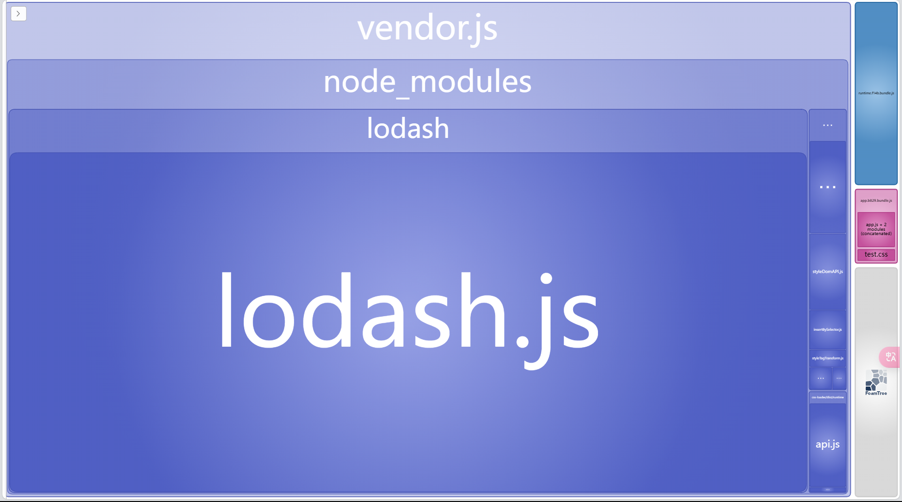

## webpack 项目实战

上面仅仅是对webpack的概念以及核心模块进行了介绍，但是在实际的运用过程中，我们还会遇到诸如资源压缩、代码分割、异步加载等性能优化的问题，所以下面将通过一个完整的项目来解决这些问题。

1. 新建一个空的项目文件夹，运行 `npm init -y` 生成 `package.json` 文件

2. 全局安装 webpack 以及 webpack-cli , `npm install webpack webpack-cli -g`.安装完成后我们可以使用 `webpack -v`来查看 webpack 的版本。

3. 在项目中新建一个文件：`webpack.config.js` 作为 webpack 的打包配置文件，默认打包是根目录下的这个文件。我们也可以命名为其他的文件。但是打包的时候需要用命令指定配置文件，如：`webpack --config webpack.config1111.js`

webpack.config.js

```js
// 一定要使用commonjs语法
module.exports = {
  // webpack4之后需要指定开发模式mode:"development" | "production" | "none"
  mode: "development",
  // entry指定入口文件、名字
  // entery:'./app.js',
  // entery:['./app.js',...],多入口
  entry: {
    app1: "./app.js",
    // app2:'./app.js'多入口和入口别名
  },
  // 输出配置
  output: {
    // __dirname表示当前目录所在的绝对路径
    path: __dirname + "/dist", //lujng
    filename: "[name].[hash:4].bundle.js", //文件名,这里可以写死，也可以根据入口文件名动态命名,也可以加上hash值
    // filename:'bundle.js'//文件名,这里可以写死，也可以根据入口文件名动态命名
  },
  resolve: {},
  devServer: {},
  //   压缩相关，通常我们把跟压缩相关的插件写在这里面
  optimization: {},
  //   loader的写法：module对象，使用rules数组包裹，里面一个对象就是一个loader
  module: {},
  //   插件:用数组装，所有的插件都要用new plugins注册
  plugins: [
    // new plugins(),
  ],
};
```

现在在项目里面分别创建几个 js 文件用来做测试

app.js

```js
import b from "./a";
() => {
  let a = 23;
  console.log("=====>>> ", b);
  console.log("=====>>> ", a);
};
```

a.js

```js
let b = 3;
console.log("=====>>> ", b);
export default b + 1;
```

4. 上面的webpack.config.js仅仅包含了 webpack 的基本配置，配置完成之后我们就可以运行 `webpack` 命令进行打包。

## babel-loader 的使用

`babel-loader` 是用来将 ES6 的语法转换成 ES5 的一个 loader，但是其 `babel-loader` 本身是不会做编译的，它仅仅是相当于一个接口，实际上去调用 `@babel/core` 这个核心进行编译。

安装：`npm install babel-loader @babel/core --save-dev`

配置

```js
 rules: [
      // loader格式，test表示匹配什么文件，loader|use 表示使用哪个loader处理这种文件
      {
        test: /\.js$/,
        // loader:"babel-loader",
        // use:[],
        use: {
          loader: "babel-loader",
          // loader的配置
          options: {
          },
        },
      },
    ],
```

完成上面的配置之后，我们可以打包测试一下：发现打包结果并没有将 ES6 语法转换成 ES5 的语法。原因是 这个转换的语法规则有很多，然而这个 loader 并不知道使用哪种规范，所以我们还需要指定使用哪一种规范进行转换。

安装 `babel/preset-env`: `npm install @babel/preset-env --save-dev`

配置

```js
    rules: [
      // loader格式，test表示匹配什么文件，loader表示使用那个loader
      {
        test: /\.js$/,
        // loader:"babel-loader",
        // use:[],
        use: {
          loader: "babel-loader",
          // loader的配置
          options: {
            presets: [
              [
                "@babel/preset-env",
                {
                  targets: {
                    browsers: [">1%", "last 2 versions", "not ie<=8"],//告诉loader，处理规则： 要支持占有率大于1%的浏览器，支持所有浏览器最近的两个版本，不支持ie8及以下的浏览器
                  },
                },
              ],
            ],
          },
        },
      },
    ],
```

配置完后进行打包，可以发现 我们在 js 里面使用的 箭头函数和 let 语句，已经被打包转成 ES5 的 函数 和 var 了。

在实际项目中，我们不会直接在 webpack.coinfig.js 这个文件里面去写这么多的 loader 配置项，这样会显得很繁琐。通常情况下，我们会在项目的根目录下面新建一个 JSON 格式的文件：`.babelrc`，表示 babel-loader 的配置文件.

.babelrc

```js
{
  "presets": [
    [
      "@babel/preset-env",
      {
        "targets": {
          "browsers": [">1%", "last 2 versions", "not ie<=8"] //告诉loader，处理规则： 要支持占有率大于1%的浏览器，支持所有浏览器最近的两个版本，不支持ie8
        }
      }
    ]
  ]
}

```

## Eslint 使用

Eslint 是用来对编码规范的一套准则，在 webapck3、webapck4 中我们需要使用 `Eslint-loader` 进行配置，但是在 webpack5 中这个 loader 已经废弃.我们需要使用 `Eslint-webpack-plugin`这个插件来定义规范。eslint 本身是不做代码规范的，我们需要根据项目里面每个成员的开发习惯做出相应的配置来规范我们的开发规范.比如一些常见的：不准使用 console、换行有几个空格等。

安装：`npm install eslint eslint-webpack-plugin --save-dev`
引入和使用

webpack.comfig.js

```js
// 引入eslint插件
const ESLintWebpackPlugin = require('eslint-webpack-plugin')
...

// 注册插件
plugins: [
    new ESLintWebpackPlugin(),
  ],
```

在注册插件的时候，我们可以在 `new ESLintWebpackPlugin({})`传入一个配置对象对插件进行配置，但是一般的做法是新建一个 `.eslintrc.js` 文件作为 eslint 的配置文件.

.eslintrc.js

```js
module.exports = {
  // 配置环境
  env: {
    // 因为我们的代码实在浏览器上面去运行的，所以需要配置 browser为true，这样我们就可以使用一些浏览器的全局环境，比如:window，document等，
    browser: true,
    node: true, //如果设置为node为true，则表示在node环境下运行，那么我们就不能使用window和等浏览器的全局变量
    es2021: true, //表示当前项目的es环境是一个2021的语法
  },
  // 继承：如果我们不想一条条的写eslint的配置，我们就可以使用继承的方式，使用一些已经配置好了的规则
  extends: [],
  // 插件：
  plugins: [],
  // 语法解析的配置
  parserOptions: {
    ecmaVerson: 6, //ecma的版本是ecma 6
    sourceType: "module", //模块化的语法是module
    // 一些ecma的特性
    ecmaFeature: {
      jsx: true, //如果项目里面使用了jsx语法，则设置为true，那么eslint就会去检查jsx的语法
    },
  },
  // 重中之重，定义eslint的具体检查细节，需要的时候去官网查看规则
  rules: {
    // "no-console": 2,
  },
};
```

上面我们队 eslint 进行了基本的配置，比如我们在 rulues 中配置了`"no-console":2`(项目里面如果使用了 console 语句就会直接抛出错误)， 我们可以使用 `webpack-dev-server` 来打包检查一下。

比较推荐的两个现成的规范：`eslint-config-standard` 和 `eslint-cionfig-airbnb`，我们只需要安装后，继承这两个插件的规范就可以使用这两个插件的规范了。

安装：`npm install eslint-config-standard --save-dev`

.eslintrc.js

```js
  extends: [
    "standard"
  ],
  ...
    rules: {
      // 如果对现成的配置不满意的，我们还可以在rules中重新配置，他会覆盖掉上面插件的同名配置
    },
```

针对 Vue 的语法，可以继承 `eslint-plugin-vue` 这个插件的配置来完成检查。

安装 ：`npm install eslint-plugin-vue --save-dev`

配置

```js
  extends: [
    "standard",
    "plugin:vue/strongly-recommended"
  ],
  plugins: [
"vue"
  ],
```

## CSS 与资源文件处理

### CSS 文件处理

由于 webpack 也不认识 css 类型(css、scss、less、styl等)的文件，这个时候可以去官方文档或者github中查找对应的loader来处理对应的文件。比如需要使用 `css-loader` 来让 webpack 识别 css 文件，然后使用 `style-loader`(这种方式是把 css 的内容写入到 js 文件中，然后再在 html 中使用 script 标签插入) 或者 `mini-css-extra-plugin`(将 css 文件作为单独文件进行打包)，这两种方案来处理 css 文件.

例如：我们在项目里面新建一个 css 文件，并引入到入口文件中，然后进行打包。这个时候项目会报错：`不能识别到 css 格式的文件`。

安装 ：`npm install css-loader style-loader mini-css-extract-plugin --save-dev`

webpack.config.js

```js
// 配置 css-loader
{
        test: /\.css/,//检测规则，以css结尾的文件
        use: ['css-loader']//匹配规则：从右到左，从下到上
      }
```

完成上面的配置之后， webpack 就能够识别 css 文件，因此打包不会报错，也能够将 css 文件进行打包。但是此时我们并没有告诉 webpack 如何去处理 css 文件，，所以打包后的文件里面并没有对 css 文件进行处理。这个时候就需要配置 `style-loader`

```js
{
        test: /\.css/,
        use: ['style-loader', 'css-loader']
      }
```

上面的代码是告诉 webopack 先用 `css-loader` 将css文件资源编译成commonjs的模块到js中，然后再使用 `style-loader` 将js中的css代码通过创建`<style></style>`标签添加到html文件中生效。通过对打包后的文件观察可以发现，由于加入了了 css 代码打包后的文件会比之前大了很多。

通常，在项目配置文件中，我们一般会将 css 文件单独打包成 css 文件，而不是像上面这样使用 style 标签注入。所以我们还需要使用 `mini-css-extract-plugin` 这个插件进行配置.

webpack.config.js

```js
// 引入 mini-css-extract-plugin
const minicssplugin = require('mini-css-extract-plugin')

// 注册
plugins: [
  new minicssplugin({
    filename: 'text.bundle.css'
  })
]

// 使用
{
  test: /\.css/,
  use: [minicssplugin.loader, 'css-loader']
}
```

完成上面的配置之后，再进行打包，这个时候的 css 文件就不会使用 scrpit 标签在 html 中引入了，而是打包成了一个单独的 css 文件，叫做 text.bundle.css。

如果我们在项目里面使用的是 css 预处理语言 `less` 和 `sass`，那么根据同样的道理，我们需要使用 less 或者 sass 相关的 loader 将 sass 和 less 文件转成 css 文件，然后在使用上面的 loader 或者插件进行配置。

安装: `npm install less less-loader --save-dev`

使用

```js
{
  test: /\.less/,
  use: [minicssplugin.loader, 'css-loader','less-loader']
}
```

这个时候我们就能够对 less 文件进行打包处理了，但是我们打包后的文件并没有对 css 文件进行压缩，所以这个时候还需要配置压缩插件.

安装: `npm installl css-minimizer-webpack-plugin --save-dev`

注册

```js
plugins: [
  // new plugins(),
  new minimizer(),
  new minicssplugin({
    filename: "text.bundle.css",
  }),
];
```

完成上面的配置后我们再打包这个时候 css 文件就是已经被压缩过后的代码了。

### less文件处理
同样，对于less文件的处理，webpack同样是不能识别less文件的。因此我们也需要在项目中使用less-loader来对less文件进行处理。
```js
npm install less less-loader --save-dev
```

### 资源文件的处理

为了让 webpoak 能够识别到资源文件，如 MP3，MP4，img 等，在 webapck3 和 webapck4 中我们还需要使用 `file-loader` 和 `url-loader` 来进行处理，file-loader 能够识别处理文件，url-loader 是对 file-loader 的继承，他提供了额外的功能，例如:转 base64 或者 hash 等。但是在 webpack 5 中就已经自带了相关的处理方式，我们就不需要再需要单独使用别的 loader 来处理了。

### 使用 loader 插件处理

安装：`npm install file-loader url-loader --save-dev`

配置

```js
// 例如我们配置图片文件
{
  test: /\.(png|gif|svg|jpeg|jpe)$/,
  use: 'url-loader',
  options: {
    limit: 5000,
    name: '[name].[hash].[ext]'
  }
}
```

上面的代码告诉 webpack，遇到上面配置的文件的后缀的时候使用 url-loader 进行处理，同时配置，小于 5000kb 的文件进行转 base64，文件的名字是 文件名+哈希值+后缀。

### webpack5 自带的 loader 处理

```js
{
  test: /\.(png|gif|svg|jpeg|jpe)$/,
  type: 'asset/inline',
}
```

- type: 'asset/inline': 表示所有的图片都打包成 base64
- type: 'asset/resource': 表示所有的静态文件都单独打包成文件

一般为了自定义写法，都会按照下面的方式写

```js
 {
       test: /\.(png|gif|svg|jpeg|jpe)$/,
       type: 'asset',//通用
       parser: {
         dataUrlCondition: {
          // 对于大于5000kb的文件进行打包，小于5000kb的文件转成base64进行
          // 使用base64的文件，体积会变大，但是相应的也会减少静态资源的请求，项目中可以根据自己的实际情况进行选择
           maxSize: 5000
         }
       },
       generator: {
        // 输出配置：输出文件名设置 name:文件名 hash生成的hash值，ext拓展名 query携带的参数
        // 如果觉得hash过长，可以使用[hash:10]来取前10位的hash值
         filename: '[name].[hash].[ext]'
       }
     }
```

## loader 的本质

loader 本质是一个方法，该方法接受到需要处理的资源的内容，处理完后返回内容作为打包后的文件。

## html 的处理

## 代码分割

无论是单入口文件还是多入口文件，我们在打包后所有的引入和资源文件都会被打包成一个或者多个文件中。这样会导致打包后的文件体积过大，或者资源重复加载的问题，不仅仅会导致首屏加载的资源过多，导致首屏时间过长，也会导致请求服务器资源重复，增加服务器压力等问题。下面我们将针对 单入口文件 和 多入口文件 分别进行优化。

### 单入口的处理

单入口意味着我们所有的代码(包括业务代码、静态资源、第三方库等)在一个文件里面，这样会导致打包后的代码体积过大，代码冗余。所以我们需要把一些不是首屏马上用到的代码拆分出来，这样可以加快首屏速度。

例如：我们在项目中 将上面的 a.js 采用异步引入的方式

app.js

```js
import "./test.css";
setTimeout(() => {
  // import()导入返回的也是一个Promise值，res就是b里面的内容对象
  import("./a").then((res) => {
    console.log(res);
    console.log(res.default);
  });
}, 3000);
```

通过上面我们使用定时器异步引入文件， 他会在页面加载后的 3s 后才开始加载，并且在加载完之后会执行 then 里面的回调。这里打包之后我们的 a.js 文件会被单独打包成一个文件，比如我在测试的时候名字叫做：a_js.989f.bundle.js.
:::tip
上面的配置，a.js 文件打包后名字除了正常的哈希值之外，在名字后面还有 \_js 这种字符串，我们可以使用 `魔法注释` 来更改打包后的名字。

```js
import "./test.css";
setTimeout(() => {
  import(/* webpackChunkName: "a" */ "./a").then((res) => {
    console.log(res);
    console.log(res.default);
  });
}, 3000);
```

打包后的 a 的名字就会没哟前面的 js 样式了：a.ee2c.bundle.js。
:::

另外一种异步引入的方式是 `require.ensure`

```js
// require.ensure()接收3个参数，第一个参数是后面回调函数中需要的依赖数组，第二个参数是引入后的回调，第三个参数是打包的名字。
  require.ensure([], () => {
    const b = require('./a')
    console.log(b)
    console.log(b.default)
  },"a")
}, 3000)
```

### 多入口处理

多入口的问题主要是重复加载同一段逻辑代码，比如在 app.js 中使用了 b.js，在 app2.js 中也是用了 b.js，那么在打包的时候，两个 app 的文件都会将 b.js 打入自己的文件中，在加载页面的时候，也会请求两次 b.js 资源，这个时候理想的打包方式是 将公共的文件都单独打包出来，这样在 app.js 中第一次加载资源的时候，就会缓存 b.js，app2.js 中就可以直接使用缓存。

app.js

```js
import b from "./a";
import "./test.css";
() => {
  const a = 23;
  console.log("=====>>> ", b);
  console.log("=====>>> ", a);
};
```

app2.js

```js
import b from "./a";
import "./test.css";
() => {
  const a = 23;
  console.log("=====>>> ", b);
  console.log("=====>>> ", a);
};
```

上面的代码进行打包后，两个打包后的入口文件都会引入 a.js，会造成多次引入。

```js
  //   压缩相关
  optimization: {
    splitChunks: {
      chunks: 'all', // chunks表示对什么类型的chunks进行单独打包，all：全部类型，async表示异步的chunks，initial表示初始化的chunks
      minChunks: 2,//出现次数超过2次，就进行单独打包
      minSize: 0,//单独打包的最小大小,这里我们做测试就设置成 0
      name:"a"，//拆分后chunks的名字
    }
  },
```

上面是使用 [splitChunksPlugin](https://www.webpackjs.com/plugins/split-chunks-plugin/) 对拆分的几个基本配置。完成上面的代码之后，a.js 就会被单独打包成一个 chunk，在第一次加载之后就会缓存，第二次使用会直接使用缓存数据，不会再次进行加载。

### 第三方资源(vendor) 和 运行时代码(runtime) 的处理

不论是单文件入口还是多文件入口，在项目中我们经常需要将 第三方库(vendor)和 一些运行时的代码(runtime)，单独打包成 chunk，所以我们还需要设置配置。

分割第三方库和业务代码

```js
 optimization: {
    splitChunks: {
      chunks: 'all', // all,sync,initial
      cacheGroups: {
        // 第三方库的打包规则
        vendor: {
          // 匹配nodemodules下面的文件
          test: /[\\/]node_modules[\\/]/,
          // 打包名字
          filename: 'vendor.js',
          // 打包chunks的类型
          chunks: 'all',
          // 最小出现次数，设置为1次，因为第三方库一般情况下只会引入一次
          minChunks: 1
        },
        // 除了第三方库的业务代码打包规则，比如之前用到的 a.js,c.jsjs都会打包到common.js
        common: {
          filename: 'common.js',
          chunks: 'all',
          minChunks: 2,
          minSize: 0
        }
      }
    }
  },
```

runtime 代码分割

::: tip webpack 相关杂项

###### hash 值的作用

在每次使用 webpack 打包之后，打包后的 chunks 名都会拼接上一个统一的 hash 值，这样的作用是当文件内容更改了之后，打包生成的的 hash 值不一样，名字也就不一样，这样在使用资源的时候，浏览器发现名字不一样就不会使用缓存，而是去重新请求资源。

使用 hash 值的时候，一般是一次打包生成一个 hash 值，每个 chunks 的 hash 值都一样的，这样就会导致一个问题，当只改动了某一个文件的时候，会导致整个打包的 hash 值发生改变，也就会导致所有的 chunks 名字发生了改变，所以所有的文件都会重新加载新的资源，这样会导致资源消耗。这个时候我们就需要使用 chunkhash 了(在 webpack.config.js 中把`[name].[hash:4].js`替换成`[name].[chunkhash:4].js`)，这个 chunkhash 是跟文件绑定的，每个文件都会生成一个 hash 值，只有改变的文件 hash 值才会改变，这样在请求的时候只会请求改变的文件。

###### resolve 的作用

resolve()在项目中常用的配置就是配置路径别名和批量引入。

resolve.alias：创建 import 或 require 的别名，来确保模块引入变得更简单。

```js
resolve: {
    alias: {
      '@': path.resolve('./src'), // 使用 @ 代替 src
    },
},
```

批量引入

require.context 批量引入指定文件夹下的所有文件.例如我们要引入 mode 文件夹下面的所有文件，按照 es6 的语法我们需要一个一个使用 imoirt 引入，但是我们可以用这个方法进行引入

```js
// 第一个参数表示要让引入的文件加名字，第二个参数表示目标文件夹下如果有文件夹是否递归引入，但3个参数表示引入的匹配规则，这里定义的是引入西面的js文件
const r = require.context("./mode", false, /.js/);
r.keys().forEach((item) => {
  console.log(r(item).default);
});
```

有的时候我们希望我们打包后的文件按照文件类型放到不同的文件夹下面(比如将 css 类型文件放到 css 文件夹下面，而不是统一的放到 dist 文件夹下面)，这个时候我们只需要在所有的 filename 后面文件名前面加上文件夹名字就好了，webpack 会自动创建这个文件夹，并且会把对应的文件放到文件夹下面，如：`filename:"./css/[name].[hash].css"`。
:::

## 开发模式

开发模式的作用

安装 `webpack-dev-server` : `npm install html-webpack-plugin --save-dev`

### 模拟 webpack 打包流程

1. 新建一个项目，初始化.

webpack.config.js

```js
const htmlWebpackPlugin = require("html-webpack-plugin");
module.exports = {
  mode: "development",
  entry: {
    app: "./app.js",
  },
  output: {
    path: __dirname + "/dist",
    filename: "[name].[chunkhash:4].bundle.js",
  },
  plugins: [
    new htmlWebpackPlugin({
      filename: "index.html",
      template: "./index.html",
    }),
  ],
};
```

app.js

```js
console.log(123);
```

index.html

```html
<!DOCTYPE html>
<html lang="en">
  <head>
    <meta charset="UTF-8" />
    <meta name="viewport" content="width=device-width, initial-scale=1.0" />
    <title>Document</title>
  </head>
  <body>
    <h1>wenbpack-demo</h1>
  </body>
</html>
```

:::tip
webpack-dev-middleware 是一个包装器，它可以把 webpack 处理过的文件发送到 server。这是 webpack-dev-server 内部的原理，但是它也可以作为一个单独的包使用，以便根据需求进行更多自定义设置。
:::

2. 服务启动配置文件：mydev.js

```js
// node框架，用来启动一个服务
const express = require("express");
// webpack打包中间件
const webpackDevMiddleWare = require("webpack-dev-middleware");
// 引入webpack方法，提供打包服务
const webpack = require("webpack");
// 引入配置文件
const config = require("./webpack.config");
// 生成打包后的目标文件
const dist = webpack(config);

// 创建一个服务，并且将打包后的文件部署到这个服务上面
const app = express();
app.use(webpackDevMiddleWare(dist));

// 将服务挂载到3000端口
app.listen(3000, () => {
  console.log("服务已经启动");
});
```

最后我们运行 `node mydev.js`，这样 webpack 就在本地的3000端口上开启了一个服务.

### devServer

`webpack-dev-server` 简写 `dev-server`,他提供了一个能够实时重新加载的基本 web server。

安装依赖：`npm install --save-dev webpack-dev-server`

webpack.config.js(修改配置文件，告诉 dev-server 应该从什么位置开始查找文件)

```js
const htmlWebpackPlugin = require("html-webpack-plugin");
module.exports = {
  mode: "development",
  entry: {
    app: "./app.js",
  },
  output: {
    path: __dirname + "/dist",
    filename: "[name].[chunkhash:4].bundle.js",
  },
  // 下面的配置告知 webpack-dev-server 将 dist 目录下的文件作为可访问资源部署在 localhost:1000。
  devServer: {
    port: 1000,
    hot: true, //热更新
    static: "./dist",
  },
  plugins: [
    new htmlWebpackPlugin({
      filename: "index.html",
      template: "./index.html",
    }),
  ],
};
```

使用 `webpack-dev-server` 启动这个服务。
:::tip
webpack-dev-server 在编译之后不会写入任何输出文件，而是将 bundle 文件保留在内存中，然后将它们作为可访问资源部署在 server 中，就像是挂载在 server 根路径上的真实文件一样。如果页面希望在不同路径中找到 bundle 文件，可以修改 dev server 配置中的 devMiddleware.publicPath 选项。
:::

::: tip 热更新和强制更新
热更新在不刷新浏览器的情况下更新页面，可以保持页面的当前状态，一般来说 css 样式更新是热更新的。

强制更新会自动刷新页面来更新页面，会重置页面状态,任何的 js 代码更新都是强制更新。
:::

### devServer.proxy

proxy 就是由我们的 webpack-dev-server 开启 node 服务来代替我们请求接口，因为如果后端没有开启 cors，我们直接从前端请求就会跨域。我们可以利用 proxy 让请求从 node 服务发起请求，这样两个服务器之间发起请求就不会出现跨域的情况。

```js
  devServer: {
    port: 1000,
    hot: true, //热更新
        // 代理
    proxy: {
      // 只要匹配上下面这条规则，就执行代理转发
      // "http://localhost:3000":{
      // target:"http://localhost:3000"
      // },
      "/": {
        target: "http://localhost:3000",
        // 路径重写：有时候我们请求的接口路径很长，我们就可以使用简写，当匹配到这个简写的时候，就用后面的完整地址重写我们的简写地址
        pathRewrite:{
            "^/num1":"/api/getnum1",
            "^/num2":"/api/getnum2",
        },
        headers:{}
      },
      "/api2": {
        target: "http://localhost:3000",
        // 路径重写：有时候我们请求的接口路径很长，我们就可以使用简写，当匹配到这个简写的时候，就用后面的完整地址重写我们的简写地址
        pathRewrite:{
            "^/num1":"/api/getnum1",
            "^/num2":"/api/getnum2",
        },
        headers:{}
      },
    },
  },
```

## source map(资源映射) 

```js
1.手动试一下并贴出结果图片？？？
2.前端监控sentry ?????
3.打包优化？？？？
```

当 webpack 打包源代码时，可能会很难追踪到错误和警告在源代码中的原始位置。例如，如果将三个源文件（a.js，b.js 和 c.js）打包到一个 bundle（bundle.js）中，而其中一个源文件包含错误，那么堆栈跟踪就会直接指向到 bundle.js，却无法准确知道错误来自于哪个源文件，所以这种提示通常无法提供太多帮助。

为了更容易地追踪错误与警告在源代码中的原始位置，JavaScript 提供了 source map 功能，可以帮助将编译后的代码映射回原始源代码。source map 会直接告诉开发者错误来源于哪一个源代码。

在 webpack 中，我们使用 devtool 这个选项来配置资源映射的风格。不同的值会明显影响到构建和重新构建的速度。

语法：`devtool:string = 'eval' false`

常见的选项：

- none：有更快的构建和重构速度，推荐在生产环境使用。
- eval-cheap-source-map：不推荐在生产环境使用，这种构建方式会映射到源资源文件上面。
  更多的配置，参考[官网](https://www.webpackjs.com/configuration/devtool)
  :::tip
  对于开发环境，通常希望更快速的 source map，需要添加到 bundle 中以增加体积为代价，但是对于生产环境，则希望更精准的 source map，需要从 bundle 中分离并独立存在。
  :::
  :::tip 官方推荐
  我们鼓励你在生产环境中启用 source map，因为它们对 debug(调试源码) 和运行 benchmark tests(基准测试) 很有帮助。虽然有着如此强大的功能，然而还是应该针对生产环境用途，选择一个可以快速构建的推荐配置（更多选项请查看 devtool）。对于本指南，我们将在 生产环境 中使用 source-map 选项，而不是我们在开发环境中用到的 inline-source-map：

  ```js
  const { merge } = require("webpack-merge");
  const common = require("./webpack.common.js");

  module.exports = merge(common, {
    mode: "production",
    devtool: "source-map",
  });
  ```

  :::

## 实战配置技巧

在实际的开发工作中，我们可能需要根据不同的环境使用不同的配置文件或者配置选项。比如，在生产环境我们需要压缩代码，使用 tree-shaking，关闭 source map。来提高我们生产环境的打包速度，压缩代码大小等；但是在开发环境，我们需要详细的 source map，也不需要 压缩代码 和 代码混淆 等，这样会降低打包速度，增大打包的体积，保留了代码的基本格式，这样方便我们在开发环境更好的调试.

区分要点：

- 根据不同的环境进行不同的打包，在 配置文件中，一般是在 process.env 中获取环境信息

- 有的时候需要业务代码(js 等)中获取环境，我们需要借助插件完成。

比如我们需要根据环境来使用不同的配置，我们可以把 webpack.config.js 拆分成不同环境的配置文件：webpack.baseconfig.js(基础配置) webpack.prodconfig.js(生产环境配置) webpack.devconfig.js(开发环境配置)，然后使用 node 提供的 `process.env` 来获取环境变量。

webpack.baseconfig.js

```js
const htmlWebpackPlugin = require("html-webpack-plugin");
const minicss = require("mini-css-extract-plugin");

let pluginArr = [
  new htmlWebpackPlugin({
    filename: "index.html",
    template: "./index.html",
  }),
];
function hasMiniCss() {
  if (process.env.NODE_ENV == "production") {
    pluginArr.push(
      new minicss({
        filename: "test.bundle.css",
      })
    );
  }
}
hasMiniCss();

module.exports = {
  entry: {
    app: "./app.js",
  },
  output: {
    path: __dirname + "/dist",
    filename: "[name].[chunkhash:4].bundle.js",
  },

  module: {
    rules: [
      {
        test: /\.css$/,
        use: ["style-loader", "css-loader"],
      },
    ],
  },
  plugins: pluginArr,
};
```

webpack.devconfig.js

```js
const base = require("./webpack.baseconfig");
// webpack提供的merge合并的方法，合并两个配置，有重名的后面的配置会替换掉前面的配置
const merge = require("webpack-merge").merge;

const webpack = require("webpack");

module.exports = merge(base, {
  mode: "development",
  //   设置source-map
  devtool: "eval-cheap-source-map",
  plugins: [
    new webpack.DefinePlugin({
      baseURL: "www.devxxxx.com",
    }),
  ],
});
```

webpack.prodconfig.js

```js
const base = require("./webpack.baseconfig");
// webpack提供的merge合并的方法，合并两个配置，有重名的后面的配置会替换掉前面的配置
const merge = require("webpack-merge").merge;
const webpack = require("webpack")

module.exports = merge(base, {
  mode: "production",
  plugins:[
    new webpack.DllReferencePlugin({
      manifest:require(__dirname + "/vdendor-manifest.json")
    }),
      plugins:[
    new webpack.DefinePlugin({
      baseURL:"www.prodXXX.com"
    })
  ]
  ],

});

```

然后我们可以在 package.json 中配置打包命令

```json
  "scripts": {
    "build:prod":"webpack --config ./webpack.prodconfig.js",
    "build:dev":"webpack-dev-server --config ./webpack.devconfig.js"
  },
```

通过上面的配置，我们就可以在不同的环境中使用各自的打包配置文件了。

同时我们也可以使用 webpack CLI 的配置选项来获取环境 `webpack --config ./webpack.prodconfig.js --env/prod`

同时需要将我们的配置文件 webpack.config.js 改成函数的形式，这个函数接收一个 env 参数。

```js
module.exports = function(env){
  return merge(base(env),{
    ...
    // 配置项
  })
}
```

上面的方式是我们在配置文件中获取环境变量，但是有的时候我们想要在业务代码中也去获取环境变量，上面的方式就不支持了。这个时候我需要 webpack 自带的插件`webpack.DefinePlugin({})`来获取.

比如我们在不同环境去不同的配置这个 baseURL 变量

```js
const webpack = require("webpack");

// webpack.devconfig.js
plugins: [
  new webpack.DefinePlugin({
    baseURL: "www.devconfig.com",
  }),
];

// webpack.prodconfig.js
plugins: [
  new webpack.DefinePlugin({
    baseURL: "www.prodconfig.com",
  }),
];
```

### 打包结果分析

通过对打包结果分析，我们可以查看打包结果中的资源大小，包的引用情况等，可以方便我们更好地优化。

常见的打包结果分析方法：

- 官方方案，配置 cli 命令 `--json` 输出打包结果分析的 json 文件。
  在 package.json 文件当中添加命令`"getJson": "webpack --config ./webpack.prodconfig.js --json>stats.json"`,这样就会把打包结果分析的结果生成一个文件 `stats.json`.
  然后这个文件放到 webpack 提供的分析网站 `webpack.gethub.io.analyzer` 上进行分析。
- 使用 `webpack-bundle-analyzer` 插件，可视化分析打包结果。同时我们可以使用`speed-measure-webpack-plugin`这个插件来分析打包各个环节的时间。

安装：`npm install webpack-bundle-analyzer speed-measure-webpack-plugin -dev`

webpack.config.js

```js
// 引入打包分析插件
const bundleanalyzer = require("webpack-bundle-analyzer").BundleAnalyzerPlugin
...
plugins:[
  new bundleanalyzer()
]
```

完成上面的配置之后，执行打包命令就会自动打开浏览器，生成一个打包分析图，可以通过这个分析图查看打包结果的详细信息。


## dll 优化打包速度

使用 webpack 官方提供的 DllPlugin 插件可以为更改不频繁的代码生成单独的编译结果。尽管这增加了构建过程的复杂度，但是可以提高应用程序的编译速度。DllPlugin 和 DllReferencePlugin 用某种方法实现了拆分 bundles，同时还大幅度提升了构建的速度。

DllPlugin 配置选项：

- `context(可选)`： manifest 文件中请求的 context (默认值为 webpack 的 context)
- `format(boolean = false)`：如果为 true，则 manifest json 文件 (输出文件) 将被格式化。
- `name`：暴露出的 DLL 的函数名
- `path`：manifest.json 文件的 绝对路径（输出文件）
- `entryOnly (boolean = true)`：如果为 true，则仅暴露入口
- `type`：dll bundle 的类型

webpack.dll.config.js

```js
const Webpack = require("webpack");
module.exports = {
  mode: "development",
  entry: {
    vendor: ["axios", "lodash"],
  },
  output: {
    path: __dirname + "/dist",
    filename: "[name].dll.bundle.js",
    library: "[name]_library",
  },
  plugins: [
    new Webpack.DllPlugin({
      path: __dirname + "/[name]-manifest.json",
      name: "[name]_library",
      context: __dirname,
    }),
  ],
};
```

配置命令：`"dll": "webpack --config ./webpack.dll.config.js"`. 打包就会生成一些 vendor 的资源文件.

这个时候我们在生产配置文件 `webpack.prodconfig.js` 中配置 DllReferencePlugin

```js
plugins:[
  new webpack.DllReferencePlugin({
    // 这里的manifest名字必须和 DLLPlugin中的一样
   manifest:require(__dirname + "/vdendor-manifest.json")
  })
],
```

这样我们再去执行生产环境的打包命令，可以发现打包时间和打包体积已经得到大幅度的缩减。因为这次打包并没有将我们之前已经打包的 vendor 打入其中。

但是这个时候我们去查看打包后的 index.html 并没有 引入我们提前打包后的文件，需要手动去使用在 index.html 中去添加 script 引入。

## 压缩(Minification) 和 tree shaking(树摇优化)

代码压缩不仅仅会压缩 js 文件的格式，也会对代码进行分析，并压缩成最终的结果。

```js
let a = 1;
function t() {
  console.log(a);
}
t();
// 比如上面的一个js文件，压缩过后会直接变成下面的样子
console.log(1);
```

同时，webpack 还是实现 代码混淆，比如我们在编码的过程中会有一些语义化的变量或者特别复杂的变量(let antestdiv = "xxx")，但是在打包后变量会被改变名字 `_a、_b` 等等，这样走的好处是简化代码而且也可以防止有人通过控制台去查看源代码查看我们的明明规则去获取代码的寓意使得源码更难以阅读。

### tree-shaking

tree-shaking 是一个术语，指的是移除掉项目中不会执行的死代码。这些代码可能来自于第三方库、或者因为重构、优化或者逻辑错误代码导致的。webpack 打包能够自动的实现 tree-shaking 机制。

```js
function test(){
this.a = a+b
}
test.prototype.f1 = function(){

}
test.prototype.f2 = function(){

}
export defualt test;
```

只使用了 f1 会发现 f2 也被打进包了

## 模块热替换(HMR - hot module replacement)

模块热替换功能会在应用程序运行过程中，替换、添加或删除模块，而无需重新加载整个页面。

主要是通过以下几种方式，来显著加快开发速度：

- 保留在完全重新加载页面期间丢失的应用程序状态。
- 只更新变更内容，以节省宝贵的开发时间。
- 在源代码中 CSS/JS 产生修改时，会立刻在浏览器中进行更新，这几乎相当于在浏览器 devtools 直接更改样式。

### 如何运行 HMR 的

下面将通过 应用程序、compiler、模块、runtime 这四个角度来了解 HMR 的工作原理。

#### 应用程序

通过以下步骤，可以做到在应用程序中置换模块：

1. 应用程序要求 HMR runtime 检查更新。
2. HMR runtime 异步地下载更新，然后通知应用程序。
3. 应用程序要求 HMR runtime 应用更新。
4. HMR runtime 同步地应用更新。

可以通过设置 HMR，以使此进程自动触发更新，或者可以选择要求在用户交互时进行更新。

#### compiler

除了普通资源，compiler 需要发出 "update"，将之前的版本更新到新的版本。update 由两部分组成：

1. 更新后的 manifest(JSON)
2. 一个或多个 updated chunk(JavaScript)

manifest 包括新的 compilation hash 和所有的 updated chunk 列表。每个 chunk 都包含着全部更新模块的更新代码。compiler 会确保在这些构建之间的模块 ID 和 chunk ID 保持一致。通常将这些 ID 存储在内存中，但是也可能将他们存储在一个 JSON 文件中。

#### 模块

HMR 是可选功能，只会影响包含 HMR 代码的模块。

#### runtime

## 内部原理

打包，是指处理某些文件并将其输出为其他文件的能力。但是在输入和输出之间，还包括有 模块、入口起点、chunk、chunk 组和许多其他中间部分。

项目中使用的每个文件都是一个模块。通过项目引用，这些模块会行程一个图数据结构。在打包过程中，模块会被合并成 chunk。chunk 合并成 chunk 组，并形成 一个通过模块相互连接的图。

```js
// ./webpack.config.js
// 下面的代码会创建一个名为main的chunk组(main是入口起点的默认名称)。这个chunk组包含 ./index.js模块。
module.exports = {
  entry: "./index.js",
};

// 下面的代码会创建两个名为home和about的chunk组。每个chunk组都有一个包含一个模块的chunk：./home.js 对应 home，./about.js 对应 about。
module.exports = {
  entry: {
    home: "./home.js",
    about: "./about.js",
  },
};
```
