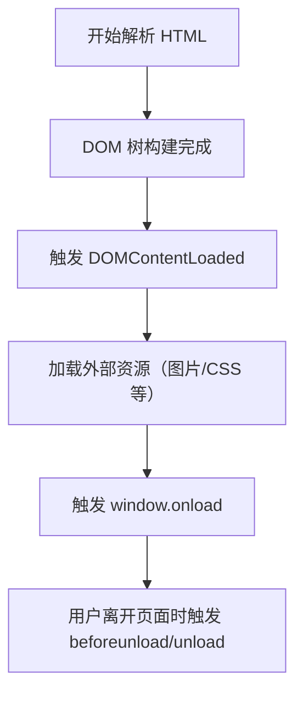
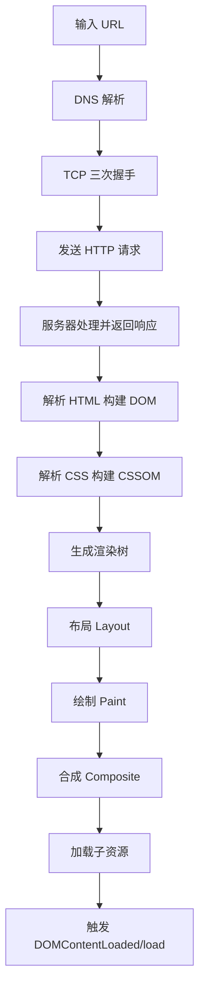
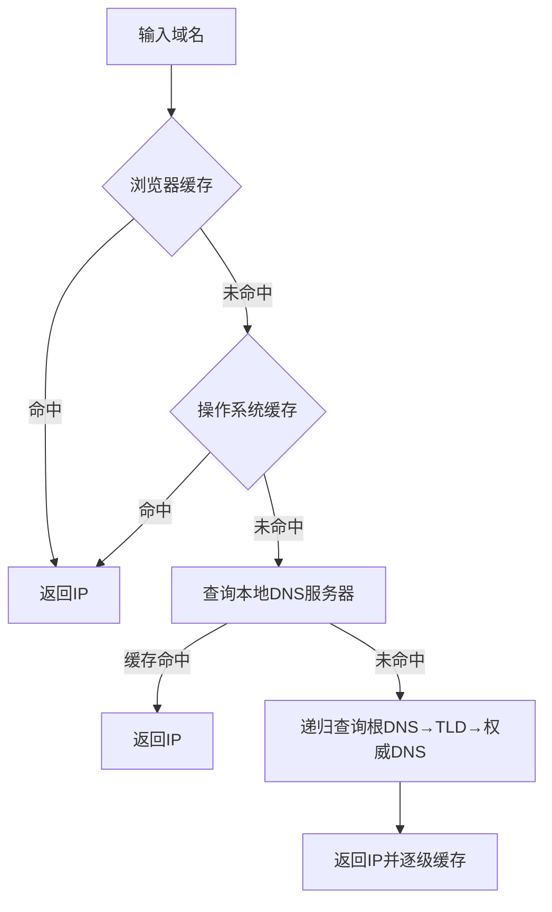

## js 异步加载的方式

异步加载 JavaScript 资源是优化网页性能的关键技术，可以避免阻塞页面渲染。

### **一、`<script>` 标签的异步加载属性**

#### 1. **`async` 属性**

- **特点**：异步下载脚本，**下载完成后立即执行**（执行时会阻塞 HTML 解析）。多个 `async` 脚本的执行顺序**不确定**（先下载完的先执行）。
- **适用场景**：独立脚本（如统计代码、第三方 SDK），不依赖其他脚本或 DOM。

#### 2. **`defer` 属性**

- **特点**：异步下载脚本，但延迟到 **HTML 解析完成后、`DOMContentLoaded` 事件前**按顺序执行。多个 `defer` 脚本的执行顺序**与声明顺序一致**。
- **适用场景**：依赖 DOM 或其他脚本的代码（如页面初始化逻辑）。

### **二、动态创建 `<script>` 标签**

通过 JavaScript 动态插入脚本，实现更灵活的控制：

```javascript
const script = document.createElement("script");
script.src = "script.js";
script.async = true; // 可选，默认是异步加载
document.head.appendChild(script);
```

- **特点**：
  - 默认异步加载（类似 `async`），但可通过 `script.async = false` 改为同步。
  - 可通过 `onload` 和 `onerror` 监听加载状态。
- **适用场景**：需要条件加载或动态依赖的脚本。

---

### **三、模块化动态加载（ES Modules）**

使用 ES6 的 `import()` 动态导入模块：

```javascript
// 动态加载模块（返回 Promise）
import("./module.js")
  .then((module) => {
    module.init(); // 使用模块
  })
  .catch((err) => {
    console.error("加载失败", err);
  });
```

- **特点**：
  - 原生支持的模块化方案，兼容现代浏览器。
  - 按需加载，适合代码分割（Code Splitting）。
- **适用场景**：基于 Webpack/Rollup 等打包工具的现代前端项目。

---

如何监听异步 js 加载成功和失败？

通过 script 标签的事件我们可以监听 js 是否加载成功。

```js
script.addEventListener("load", () => {
  console.log("脚本加载成功");
});
script.addEventListener("error", () => {
  console.error("脚本加载失败");
});
```

## onload 和 DOMContentLoaded 有什么区别

onload 和 DOMContentLoaded 是 JavaScript 中两个重要的页面加载事件，但它们的触发时机和用途有显著区别。

### DOMContentLoaded

当 HTML 文档完全解析完成（所有 HTML/DOM 结构已构建完毕），无需等待样式表、图片或子框架加载完成。DOMContentLoaded 关注 DOM 树的就绪状态，适用于需要操作 DOM 元素和无需等待别的资源(图片、css 资源等)加载完成的场景。

```js
document.addEventListener("DOMContentLoaded", () => {
  console.log("DOM 已就绪，但外部资源可能未加载完");
});
```

如果脚本使用 async 或 defer，DOMContentLoaded 不会等待这些脚本执行完成（除非脚本是 defer 且未执行完）。

### window.onload

当 整个页面完全加载完毕，包括 HTML、CSS、JS、图片、iframe 等所有依赖资源。onLoad 关注页面所有内容的完整性。适用于需要获取图片或者 iframe 尺寸的场景，也可以用于第三方广告/统计代码需要在页面完全就绪后运行。

```js
window.onload = function () {
  console.log("页面所有资源（包括图片）已加载完成");
};
```

```
需要注意的是window.onload需要所有的资源加载完成后才会触发，所以当页面上的资源过于多或者庞大的情况下，这个方法的执行时机可能会有延后，进而导致脚本延迟执行。
```

## JavaScript 中常用的页面加载事件

在 JavaScript 中，常用的页面加载事件主要有以下几个，它们在不同的加载阶段触发，适用于不同的场景：

---

### **1. `DOMContentLoaded`**

- **触发时机**：当 **HTML 文档完全解析完成**（DOM 树构建完毕），**无需等待样式表、图片或子框架加载完成**。
- **监听方式**：
  ```javascript
  document.addEventListener("DOMContentLoaded", () => {
    console.log("DOM 已就绪，可安全操作 DOM");
  });
  ```
- **适用场景**：
  - 需要尽早操作 DOM 元素（如绑定事件、修改内容）。
  - 希望避免因图片等资源加载延迟脚本执行。

---

### **2. `window.onload`**

- **触发时机**：当 **整个页面完全加载完毕**，包括 HTML、CSS、JS、图片、iframe 等所有依赖资源。
- **监听方式**：
  ```javascript
  window.onload = function () {
    console.log("所有资源（包括图片）已加载完成");
  };
  ```
  > ⚠️ 注意：多次赋值 `window.onload` 会覆盖之前的回调，建议使用 `addEventListener`。
- **适用场景**：
  - 需要获取图片尺寸、iframe 内容等依赖完整资源的操作。

---

### **3. `document.readystatechange`**

- **触发时机**：通过 `document.readyState` 状态变化监听页面加载阶段：
  - `loading`：文档正在加载。
  - `interactive`：DOM 已就绪（类似 `DOMContentLoaded`）。
  - `complete`：页面完全加载（类似 `window.onload`）。
- **监听方式**：
  ```javascript
  document.onreadystatechange = () => {
    if (document.readyState === "interactive") {
      console.log("DOM 已就绪");
    } else if (document.readyState === "complete") {
      console.log("页面完全加载");
    }
  };
  ```

---

### **4. `beforeunload`**

- **触发时机**：当用户即将离开页面（关闭标签页、刷新、跳转等）。
- **监听方式**：
  ```javascript
  window.addEventListener("beforeunload", (e) => {
    e.preventDefault(); // 需兼容旧浏览器
    e.returnValue = "确定离开吗？"; // 自定义提示文本
    return "确定离开吗？"; // 部分浏览器需要返回值
  });
  ```
- **适用场景**：
  - 提示用户保存未提交的数据。

---

### **5. `unload`**

- **触发时机**：当页面正在卸载（资源尚未完全清除，但页面已不可见）。
- **监听方式**：
  ```javascript
  window.addEventListener("unload", () => {
    console.log("页面卸载中，可发送分析数据");
  });
  ```
- **注意事项**：
  - 在此事件中无法阻止页面关闭/跳转。
  - 避免执行耗时操作（浏览器可能直接终止）。

---

### **6. `pageshow` 和 `pagehide`**

- **触发时机**：
  - `pageshow`：页面显示时（包括首次加载和从缓存恢复，如浏览器后退）。
  - `pagehide`：页面隐藏时（如跳转或关闭前）。
- **监听方式**：
  ```javascript
  window.addEventListener("pageshow", (e) => {
    if (e.persisted) console.log("页面从缓存恢复");
  });
  window.addEventListener("pagehide", () => {
    console.log("页面隐藏");
  });
  ```
- **适用场景**：
  - 处理浏览器缓存（如后退时恢复状态）。

---

### **7. `load` 事件（针对特定资源）**

- **触发时机**：当单个资源（如图片、iframe）加载完成。
- **监听方式**：
  ```javascript
  const img = new Image();
  img.addEventListener("load", () => {
    console.log("图片加载完成");
  });
  img.src = "image.jpg";
  ```

---

### **事件触发顺序总结**



---

### **最佳实践建议**

1. **操作 DOM**：优先使用 `DOMContentLoaded`（更快）。
2. **依赖完整资源**：使用 `window.onload`。
3. **离开页面提示**：用 `beforeunload`（需谨慎，可能影响用户体验）。
4. **缓存处理**：结合 `pageshow` 和 `pagehide` 优化后退体验。

---

### **代码示例：综合使用**

```javascript
// 1. DOM 就绪
document.addEventListener("DOMContentLoaded", () => {
  console.log("DOM 已就绪");
});

// 2. 页面完全加载
window.addEventListener("load", () => {
  console.log("所有资源加载完成");
});

// 3. 监听页面离开
window.addEventListener("beforeunload", (e) => {
  if (hasUnsavedData) {
    e.preventDefault();
    e.returnValue = "数据未保存，确定离开？";
  }
});

// 4. 监听缓存恢复
window.addEventListener("pageshow", (e) => {
  if (e.persisted) console.log("从缓存恢复");
});
```

理解这些事件的差异和适用场景，可以帮助你更精准地控制页面生命周期中的关键操作。

## 从浏览器输入一个地址 URL 到展示整个页面，浏览器是怎么执行的

从输入 URL 到页面展示，浏览器会经历一系列复杂的步骤，通常称为 **"关键渲染路径"（Critical Rendering Path）**。以下是详细的分步解析：

---

### **1. 输入 URL 并解析**

- **用户行为**：在地址栏输入 URL 并按下回车。
- **浏览器处理**：
  - 检查 URL 格式（如是否包含协议 `http://` 或 `https://`）。
  - 如果是域名（如 `example.com`），触发 **DNS 解析**；如果是 IP 地址，直接访问。

---

### **2. DNS 解析（域名 → IP 地址）**

- **步骤**：
  1. 检查浏览器缓存（如 Chrome 的 `chrome://net-internals/#dns`）。
  2. 检查操作系统缓存（如本地 `hosts` 文件）。
  3. 向本地 DNS 服务器（如路由器或 ISP 的 DNS）发起查询。
  4. 若未找到，递归查询根 DNS 服务器 → 顶级域（如 `.com`）→ 权威 DNS 服务器。
- **结果**：获取目标服务器的 IP 地址（如 `93.184.216.34`）。

---

### **3. 建立 TCP 连接**

- **TCP 三次握手**：
  1. 浏览器 → 服务器：发送 `SYN` 包（同步序列号）。
  2. 服务器 → 浏览器：回复 `SYN-ACK` 包（确认 + 同步）。
  3. 浏览器 → 服务器：发送 `ACK` 包（最终确认）。
- **结果**：建立可靠的 TCP 连接（HTTPS 还会在此后完成 TLS 握手）。

---

### **4. 发送 HTTP 请求**

- **请求组成**：
  - 请求行：`GET /index.html HTTP/1.1`
  - 请求头：`Host`、`User-Agent`、`Cookie` 等。
  - 请求体（如 POST 请求的数据）。
- **示例**：
  ```http
  GET /index.html HTTP/1.1
  Host: example.com
  Connection: keep-alive
  ```

---

### **5. 服务器处理请求并返回响应**

- **服务器操作**：
  - 解析请求路径和参数。
  - 生成响应（静态文件直接返回，动态内容由后端处理）。
- **响应组成**：
  - 状态行：`HTTP/1.1 200 OK`
  - 响应头：`Content-Type`、`Cache-Control` 等。
  - 响应体（HTML 文件或其他资源）。

---

### **6. 浏览器解析和渲染页面**

#### **① 解析 HTML 构建 DOM 树**

- **过程**：
  - 将 HTML 字节流转换为字符（根据编码如 UTF-8）。
  - 通过 **词法分析** 生成 Tokens（标签、属性等）。
  - 构建 **DOM 树**（Document Object Model）。
- **遇到阻塞资源**：
  - `<script>` 标签会暂停 HTML 解析（除非标记 `async` 或 `defer`）。
  - `<link rel="stylesheet">` 会阻塞渲染（但继续解析 HTML）。

#### **② 解析 CSS 构建 CSSOM 树**

- **过程**：
  - 将 CSS 规则转换为 **CSSOM 树**（CSS Object Model）。
  - 解析选择器（从右向左，如 `div p` 先找 `p` 再找 `div`）。

#### **③ 合并 DOM 和 CSSOM 生成渲染树（Render Tree）**

- **渲染树**：
  - 仅包含可见节点（排除 `display: none` 或 `<head>`）。
  - 计算每个节点的样式（继承 + 层叠）。

#### **④ 布局（Layout/Reflow）**

- **计算几何信息**：
  - 确定节点在视口（viewport）中的位置和大小。
  - 受 CSS 盒模型、浮动、定位等影响。

#### **⑤ 绘制（Paint）**

- **步骤**：
  - 将渲染树转换为屏幕上的像素（栅格化）。
  - 可能分层绘制（如 `will-change` 触发 GPU 加速）。

#### **⑥ 合成（Composite）**

- **优化**：
  - 将不同图层合并为最终页面（如 CSS `transform` 触发独立图层）。

---

### **7. 加载子资源并执行 JavaScript**

- **并行加载**：
  - 图片、字体、iframe 等资源异步加载。
  - 遵守浏览器并发请求数限制（如 Chrome 的 6 个/域名）。
- **JavaScript 执行**：
  - 同步脚本按顺序执行（可能阻塞渲染）。
  - 异步脚本（`async`/`defer`）按条件执行。

---

### **8. 触发页面生命周期事件**

1. **`DOMContentLoaded`**：DOM 树构建完成后触发。
2. **`load`**：所有资源（图片等）加载完成后触发。
3. **`beforeunload`/`unload`**：页面关闭时触发。

---

### **流程图解**



---

### **性能优化关键点**

1. **减少 DNS 查询**：使用 DNS 预解析（`<link rel="dns-prefetch">`）。
2. **压缩资源**：启用 Gzip/Brotli 压缩。
3. **减少重绘/回流**：使用 CSS `transform` 替代 `top/left`。
4. **异步加载脚本**：使用 `defer` 或 `async`。
5. **缓存策略**：设置 `Cache-Control` 和 `ETag`。

---

通过理解这一完整流程，开发者可以更有针对性地优化页面加载速度和用户体验。

## DNS 解析式怎样的一个流程，DNS 信息是存储在什么位置的

DNS（Domain Name System）解析是将人类可读的域名（如 `www.example.com`）转换为机器可识别的 IP 地址（如 `93.184.216.34`）的过程。以下是 **DNS 解析的详细流程** 和 **解析结果的存储位置**：

---

### **一、DNS 解析流程**

#### **1. 浏览器缓存检查**

- **位置**：浏览器内存（如 Chrome 的 DNS 缓存）。
- **行为**：
  - 浏览器首先检查自身缓存中是否有该域名的 IP 地址。
  - 缓存有效期由 TTL（Time To Live）决定。
- **命令查看**（Chrome）：
  ```bash
  chrome://net-internals/#dns
  ```

#### **2. 操作系统缓存检查**

- **位置**：操作系统缓存（如 Windows 的 DNS 缓存、macOS/Linux 的 `nscd` 服务）。
- **行为**：
  - 若浏览器缓存未命中，系统会检查本地 hosts 文件（如 `/etc/hosts` 或 `C:\Windows\System32\drivers\etc\hosts`）和系统 DNS 缓存。
- **命令查看**：
  ```bash
  # Windows
  ipconfig /displaydns
  # Linux/macOS
  sudo systemd-resolve --statistics
  ```

#### **3. 本地 DNS 服务器查询**

- **位置**：路由器或 ISP（互联网服务提供商）的 DNS 服务器（如 `8.8.8.8`）。
- **行为**：
  - 向本地配置的 DNS 服务器（如家庭路由器的 DNS）发起查询。
  - 本地 DNS 服务器通常有缓存，若命中则直接返回。

#### **4. 递归查询（若缓存未命中）**

- **步骤**：
  1. **根域名服务器（Root DNS）**：返回顶级域（如 `.com`）的权威服务器地址。
  2. **顶级域名服务器（TLD DNS）**：返回二级域（如 `example.com`）的权威服务器地址。
  3. **权威域名服务器（Authoritative DNS）**：返回最终域名对应的 IP 地址。
- **示例**：
  - 查询 `www.example.com` 的 IP：
    - 根 DNS → `.com` 的 TLD DNS → `example.com` 的权威 DNS → 返回 `93.184.216.34`。

#### **5. 返回结果并缓存**

- **行为**：
  - 本地 DNS 服务器将 IP 返回给操作系统，并缓存该记录（遵循 TTL）。
  - 操作系统将结果传递给浏览器，浏览器缓存 IP。

---

### **二、DNS 解析结果的存储位置**

#### **1. 临时存储（缓存）**

| **位置**          | **存储内容**              | **有效期**              |
| ----------------- | ------------------------- | ----------------------- |
| 浏览器缓存        | 近期访问的域名-IP 映射    | 由浏览器策略或 TTL 决定 |
| 操作系统缓存      | 系统级 DNS 查询结果       | 由 TTL 或系统配置决定   |
| 路由器/DNS 服务器 | 本地网络内的 DNS 查询记录 | 由 TTL 决定             |

#### **2. 永久存储（配置）**

- **Hosts 文件**：

  - **路径**：
    - Windows: `C:\Windows\System32\drivers\etc\hosts`
    - Linux/macOS: `/etc/hosts`
  - **作用**：手动指定域名-IP 映射（优先级高于 DNS 查询）。
  - **示例**：
    ```plaintext
    127.0.0.1 localhost
    93.184.216.34 example.com
    ```

- **权威 DNS 服务器**：
  - **存储内容**：域名注册时配置的官方 DNS 记录（如 A 记录、CNAME 记录）。
  - **管理方式**：通过域名注册商（如 GoDaddy、Cloudflare）配置。

---

### **三、DNS 记录类型**

- **A 记录**：域名 → IPv4 地址。
- **AAAA 记录**：域名 → IPv6 地址。
- **CNAME 记录**：域名别名（如 `www.example.com` → `example.com`）。
- **MX 记录**：邮件服务器地址。
- **NS 记录**：指定域名的权威 DNS 服务器。

---

### **四、DNS 查询工具**

#### **1. 手动查询命令**

- **`nslookup`**：
  ```bash
  nslookup www.example.com
  ```
- **`dig`**（Linux/macOS）：
  ```bash
  dig www.example.com +trace  # 显示完整递归查询过程
  ```
- **`ping`**（测试解析结果）：
  ```bash
  ping www.example.com
  ```

#### **2. 在线工具**

- [DNS Checker](https://dnschecker.org/)
- [Google Dig](https://toolbox.googleapps.com/apps/dig/)

---

### **五、DNS 优化与安全**

1. **减少 DNS 查询时间**：
   - 使用 DNS 预解析：`<link rel="dns-prefetch" href="//example.com">`。
   - 选择低延迟 DNS 服务器（如 `1.1.1.1` 或 `8.8.8.8`）。
2. **防止 DNS 污染**：
   - 使用 DoH（DNS over HTTPS）或 DoT（DNS over TLS）。
3. **缓存控制**：
   - 合理设置 DNS 记录的 TTL（如 300 秒）。

---

### **六、完整流程图示**



通过理解 DNS 解析流程和存储位置，可以更好地诊断网络问题、优化访问速度，并配置安全的域名解析策略。

## Vue2 和 Vue3 的虚拟算法的区别

Vue 2 和 Vue 3 在虚拟 DOM（Virtual DOM）的 diff 算法上有显著优化，这些改进大幅提升了渲染性能。以下是两者的核心区别和 Vue 3 的升级点：

---

### **一、Vue 2 的虚拟 DOM 算法**

#### **1. 双端 Diff 算法**

- **策略**：按层级比较新旧虚拟 DOM 树，采用 **双指针（头尾比较）** 的方式：
  1. 比较新旧节点的头和头。
  2. 比较新旧节点的尾和尾。
  3. 比较旧头的和新尾。
  4. 比较旧尾的和新头。
  5. 若无匹配，遍历旧节点查找匹配。
- **缺点**：
  - **全量比对**：即使静态节点也会被比较。
  - **无法利用编译时优化**：运行时才分析动态节点。

#### **2. 更新粒度**

- **组件级**：当组件状态变化时，会重新渲染整个组件树（包括子组件）。

---

### **二、Vue 3 的虚拟 DOM 算法升级**

#### **1. 静态提升（Static Hoisting）**

- **优化点**：
  - 在编译阶段标记静态节点（如纯文本、无绑定的元素）。
  - **静态节点会被提升到渲染函数外部**，避免重复创建和比对。
- **效果**：
  - 减少虚拟 DOM 节点数，降低 diff 压力。

#### **2. Patch Flag（补丁标志）**

- **优化点**：
  - 编译时为动态节点添加 `PatchFlag`（如 `1` 表示文本动态，`2` 表示 class 动态）。
  - **运行时仅比对带标志的节点**，跳过静态内容。
- **示例**：
  ```javascript
  // 编译后的代码
  createElementVNode("div", null, "hello", 1 /* TEXT */);
  // 只有文本内容需要比对
  ```

#### **3. 区块树（Block Tree）**

- **优化点**：
  - 将模板划分为动态区块（Block）和静态区块。
  - **动态节点收集为数组**，直接追踪变化，无需递归遍历整棵树。
- **效果**：
  - 减少 diff 范围，尤其适合列表和条件渲染。

#### **4. 缓存事件处理函数**

- **优化点**：
  - 内联事件处理函数（如 `@click`）会被缓存，避免重复创建。

#### **5. 更快的创建函数**

- **优化点**：
  - Vue 3 使用 `createElementVNode` 和 `createElementBlock` 等更轻量的函数替代 Vue 2 的 `h()`。

---

### **三、核心算法对比**

| **特性**         | **Vue 2**            | **Vue 3**                          |
| ---------------- | -------------------- | ---------------------------------- |
| **Diff 策略**    | 双端比较（全量递归） | 动态追踪（PatchFlag + Block Tree） |
| **静态节点处理** | 每次比对             | 静态提升，跳过比对                 |
| **动态节点优化** | 无                   | PatchFlag 精准定位变化             |
| **事件处理**     | 每次渲染重新创建     | 缓存处理函数                       |
| **组件更新粒度** | 组件级               | 区块级（更细粒度）                 |
| **编译时优化**   | 较少                 | 深度参与（生成优化代码）           |

---

### **四、性能提升示例**

#### **场景：一个包含静态和动态内容的列表**

```html
<div>
  <p>Static Title</p>
  <!-- 静态 -->
  <ul>
    <li v-for="item in items" :key="item.id">{{ item.text }}</li>
    <!-- 动态 -->
  </ul>
</div>
```

- **Vue 2**：
  - 每次 `items` 变化时，全量比对 `div` 下的所有节点（包括静态 `<p>`）。
- **Vue 3**：
  - 静态 `<p>` 被提升，仅比对 `ul` 中的动态 `li`。
  - `li` 的 `PatchFlag` 标记仅检查文本变化。

---

### **五、升级背后的设计思想**

1. **编译时优化**：Vue 3 将更多工作移到编译阶段（如标记静态节点），减少运行时开销。
2. **动静分离**：通过区分静态和动态内容，缩小 diff 范围。
3. **精准更新**：利用 `PatchFlag` 和 `Block Tree` 实现靶向更新。

---

### **六、总结**

Vue 3 的虚拟 DOM 算法通过 **静态提升、PatchFlag、Block Tree** 三大核心优化，将 diff 性能提升了一个数量级，尤其在大型应用和高频更新场景下优势明显。而 Vue 2 的全量递归 diff 在复杂场景下容易成为性能瓶颈。这些改进使得 Vue 3 在保持响应式优势的同时，达到了接近原生 JavaScript 的渲染效率。

## this 是什么

## new 操作符具体执行流程

# `new` 操作符的执行流程

`new` 操作符在 JavaScript 中用于创建一个用户定义的对象类型的实例或具有构造函数的内置对象的实例。下面是 `new` 操作符的详细执行流程：

## 完整执行步骤

1. **创建一个新的空对象**

   ```javascript
   const obj = {};
   ```

2. **将该对象的原型指向构造函数的原型**

   ```javascript
   obj.__proto__ = Constructor.prototype;
   ```

   (现代浏览器更推荐使用 `Object.setPrototypeOf(obj, Constructor.prototype)`)

3. **将构造函数的作用域赋给新对象（绑定 this）**

   ```javascript
   const result = Constructor.apply(obj, arguments);
   ```

4. **判断构造函数返回值类型**
   - 如果构造函数返回了一个对象（包括数组、函数等），则返回该对象
   - 否则返回新创建的对象

## 手动实现 `new` 操作符

```javascript
function myNew(Constructor, ...args) {
  // 1. 创建一个新对象，并将其原型指向构造函数的原型
  const obj = Object.create(Constructor.prototype);

  // 2. 调用构造函数，绑定this到新对象
  const result = Constructor.apply(obj, args);

  // 3. 如果构造函数返回了一个对象，则返回该对象，否则返回新对象
  return result instanceof Object ? result : obj;
}
```

## 使用示例

```javascript
function Person(name, age) {
  this.name = name;
  this.age = age;
}

Person.prototype.sayHello = function () {
  console.log(`Hello, I'm ${this.name}`);
};

// 使用new操作符
const person1 = new Person("Alice", 25);
person1.sayHello(); // "Hello, I'm Alice"

// 使用手动实现的myNew
const person2 = myNew(Person, "Bob", 30);
person2.sayHello(); // "Hello, I'm Bob"
```

## 特殊情况处理

1. **构造函数返回原始值**：

   ```javascript
   function Foo() {
     return 123; // 会被忽略，仍然返回新对象
   }
   console.log(new Foo() instanceof Foo); // true
   ```

2. **构造函数返回对象**：
   ```javascript
   function Bar() {
     return { custom: "object" }; // 会替代默认返回的对象
   }
   console.log(new Bar()); // { custom: 'object' }
   ```

## 注意事项

- `new` 操作符不能与箭头函数一起使用，因为箭头函数没有自己的 `this` 绑定
- 如果忘记使用 `new` 调用构造函数，`this` 将指向全局对象（严格模式下为 `undefined`），可能导致意外行为
- 现代 JavaScript 中可以使用 `class` 语法，它强制必须使用 `new` 调用

理解 `new` 操作符的内部机制对于掌握 JavaScript 面向对象编程至关重要。

## ts 类型守卫是什么

# TypeScript 类型守卫（Type Guards）

类型守卫是 TypeScript 中用于在运行时检查类型并在代码块中缩小变量类型范围的机制。它们帮助 TypeScript 编译器更精确地推断类型，从而提供更好的类型检查和代码提示。

## 主要的类型守卫方式

### 1. typeof 类型守卫

用于检查基本类型（string、number、boolean、symbol 等）

```typescript
function padLeft(value: string, padding: string | number) {
  if (typeof padding === "number") {
    return Array(padding + 1).join(" ") + value; // padding 被识别为 number
  }
  return padding + value; // padding 被识别为 string
}
```

### 2. instanceof 类型守卫

用于检查类的实例

```typescript
class Bird {
  fly() {
    console.log("Flying");
  }
}

class Fish {
  swim() {
    console.log("Swimming");
  }
}

function move(pet: Bird | Fish) {
  if (pet instanceof Bird) {
    pet.fly(); // pet 被识别为 Bird
  } else {
    pet.swim(); // pet 被识别为 Fish
  }
}
```

### 3. in 操作符类型守卫

用于检查对象是否具有特定属性

```typescript
interface Circle {
  kind: "circle";
  radius: number;
}

interface Square {
  kind: "square";
  sideLength: number;
}

function getArea(shape: Circle | Square) {
  if ("radius" in shape) {
    return Math.PI * shape.radius ** 2; // shape 被识别为 Circle
  }
  return shape.sideLength ** 2; // shape 被识别为 Square
}
```

### 4. 自定义类型谓词（User-Defined Type Guards）

使用 `is` 关键字定义返回类型谓词

```typescript
function isString(test: any): test is string {
  return typeof test === "string";
}

function example(foo: any) {
  if (isString(foo)) {
    console.log(foo.length); // foo 被识别为 string
  }
}
```

### 5. 可辨识联合（Discriminated Unions）

通过共同的属性（通常是字面量类型）来区分类型

```typescript
interface Square {
  kind: "square";
  size: number;
}

interface Rectangle {
  kind: "rectangle";
  width: number;
  height: number;
}

type Shape = Square | Rectangle;

function area(shape: Shape) {
  switch (shape.kind) {
    case "square":
      return shape.size * shape.size; // shape 被识别为 Square
    case "rectangle":
      return shape.width * shape.height; // shape 被识别为 Rectangle
  }
}
```

## 类型守卫的作用

1. **缩小类型范围**：在特定代码块中提供更精确的类型信息
2. **增强类型安全**：避免类型断言（as）的滥用
3. **改善开发体验**：提供更准确的代码补全和错误检查
4. **运行时类型检查**：在 JavaScript 运行时实际执行类型验证

## 实际应用场景

1. 处理 API 响应数据
2. 表单输入验证
3. Redux reducer 中的 action 类型判断
4. 处理来自第三方库的数据

类型守卫是 TypeScript 类型系统中非常强大的特性，合理使用可以显著提高代码的类型安全性和可维护性。

## axios 怎么取消请求？cancelToken 是怎么实现的？

# Axios 取消请求的实现机制

Axios 提供了两种取消请求的方式：传统的 `CancelToken` 和较新的 `AbortController` API。

## 一、取消请求的两种方法

### 1. 使用 CancelToken (传统方式)

```javascript
const CancelToken = axios.CancelToken;
const source = CancelToken.source();

axios
  .get("/user/12345", {
    cancelToken: source.token,
  })
  .catch(function (thrown) {
    if (axios.isCancel(thrown)) {
      console.log("请求已取消", thrown.message);
    } else {
      // 处理其他错误
    }
  });

// 取消请求 (参数可选)
source.cancel("用户取消了请求");
```

### 2. 使用 AbortController (现代方式，推荐)

```javascript
const controller = new AbortController();

axios
  .get("/user/12345", {
    signal: controller.signal,
  })
  .catch(function (thrown) {
    if (axios.isCancel(thrown)) {
      console.log("请求已取消", thrown.message);
    }
  });

// 取消请求
controller.abort();
```

## 二、CancelToken 的实现原理

### 1. 核心代码结构

```javascript
function CancelToken(executor) {
  if (typeof executor !== "function") {
    throw new TypeError("executor must be a function.");
  }

  var resolvePromise;
  this.promise = new Promise(function promiseExecutor(resolve) {
    resolvePromise = resolve;
  });

  var token = this;
  executor(function cancel(message) {
    if (token.reason) {
      // 已经被取消过
      return;
    }

    token.reason = new Cancel(message);
    resolvePromise(token.reason);
  });
}
```

### 2. 实现机制解析

1. **创建 Promise**：每个 CancelToken 实例内部都会创建一个 Promise
2. **暴露取消方法**：通过 executor 函数暴露取消方法
3. **取消时触发**：当调用取消方法时：
   - 创建一个 Cancel 对象作为 reason
   - 解析 Promise (将 reason 作为值)
4. **请求适配器**：Axios 的请求适配器会监听这个 Promise
   - 如果 Promise 被解析，就中止请求

### 3. 与 XMLHttpRequest 的集成

在 xhrAdapter 中的关键代码：

```javascript
if (config.cancelToken) {
  config.cancelToken.promise.then(function onCanceled(cancel) {
    if (!request) return;
    request.abort();
    reject(cancel);
    request = null;
  });
}
```

### 4. 与 Fetch 的集成

当使用 fetchAdapter 时：

```javascript
if (config.cancelToken) {
  config.cancelToken.promise.then(function onCanceled(cancel) {
    if (!signal.aborted) {
      controller.abort();
      reject(cancel);
    }
  });
}
```

## 三、AbortController 的实现

现代浏览器实现了 `AbortController` 接口，Axios 也对其进行了支持：

```javascript
const controller = new AbortController();
const signal = controller.signal;

// 监听取消事件
signal.addEventListener("abort", () => {
  console.log("请求被取消");
});

// 触发取消
controller.abort();
```

Axios 内部会检查 `config.signal` 并添加相应的事件监听器。

## 四、两种方式的对比

| 特性           | CancelToken    | AbortController            |
| -------------- | -------------- | -------------------------- |
| 标准           | Axios 特有     | Web 标准 API               |
| 兼容性         | 所有版本       | 现代浏览器                 |
| 可取消多个请求 | 需要多个 token | 一个 controller 可控制多个 |
| 未来发展       | 已标记为弃用   | 推荐使用                   |

## 五、实际应用建议

1. **新项目**：优先使用 `AbortController`，它是 Web 标准且更灵活
2. **旧项目/兼容性需求**：继续使用 `CancelToken`
3. **React 中使用**：在 useEffect 清理函数中取消请求

```javascript
useEffect(() => {
  const controller = new AbortController();

  axios.get("/api/data", { signal: controller.signal }).then((response) => {
    /* ... */
  });

  return () => controller.abort();
}, []);
```

取消请求是处理竞态条件和优化应用性能的重要手段，理解其实现机制有助于编写更健壮的异步代码。

## AbortController API

## AbortController API 的作用详解

`AbortController` 是现代浏览器提供的一个 Web API，主要用于**中止正在进行的异步操作**，如 fetch 请求、DOM 操作等。它是处理请求取消的标准方案，比传统的 `CancelToken` 更通用和标准化。

## 核心作用

### 1. 中止 fetch 请求

最常见的用途是取消正在进行的网络请求：

```javascript
const controller = new AbortController();
const signal = controller.signal;

fetch("https://api.example.com/data", { signal })
  .then((response) => response.json())
  .catch((err) => {
    if (err.name === "AbortError") {
      console.log("请求已被取消");
    }
  });

// 取消请求
controller.abort(); // 这会触发 AbortError
```

### 2. 中止多个异步操作

一个 `AbortController` 可以同时控制多个操作：

```javascript
const controller = new AbortController();

// 同时取消多个fetch请求
fetch("/api/data1", { signal: controller.signal });
fetch("/api/data2", { signal: controller.signal });

// 一次性取消所有
controller.abort();
```

### 3. 与 DOM API 集成

某些 DOM API 也支持 `AbortSignal`：

```javascript
// 中止事件监听器
const controller = new AbortController();
element.addEventListener("click", handler, {
  signal: controller.signal,
});

// 移除监听器
controller.abort();
```

### 4. 自定义可中止操作

可以实现自己的可中止异步逻辑：

```javascript
function doAsyncTask(signal) {
  return new Promise((resolve, reject) => {
    const timeout = setTimeout(() => resolve("完成"), 5000);

    signal?.addEventListener("abort", () => {
      clearTimeout(timeout);
      reject(new DOMException("已中止", "AbortError"));
    });
  });
}

const controller = new AbortController();
doAsyncTask(controller.signal).catch((err) => console.log(err.message)); // "已中止"

controller.abort();
```

## 工作原理

1. **控制器与信号**：

   - `AbortController`：用于触发中止
   - `AbortSignal`：用于监听中止事件

2. **内部机制**：

   ```javascript
   class AbortController {
     constructor() {
       this.signal = new AbortSignal();
     }

     abort() {
       this.signal._abort();
     }
   }
   ```

3. **传播机制**：
   - 调用 `abort()` 会设置 `signal.aborted` 为 `true`
   - 触发 `signal` 的 `abort` 事件

## 优势对比

| 特性       | AbortController | 传统方案       |
| ---------- | --------------- | -------------- |
| 标准化     | W3C 标准        | 各库自有实现   |
| 兼容性     | 现代浏览器      | 广泛支持       |
| 功能范围   | 可中止多种 API  | 通常只用于请求 |
| 使用便捷性 | 简单直接        | 需要额外封装   |

## 实际应用场景

1. **组件卸载时取消请求**（React/Vue）

   ```javascript
   useEffect(() => {
     const controller = new AbortController();
     fetchData({ signal: controller.signal });

     return () => controller.abort();
   }, []);
   ```

2. **用户主动取消长时间操作**

   ```javascript
   document.getElementById("cancel-btn").addEventListener("click", () => {
     controller.abort();
   });
   ```

3. **请求竞态处理**

   ```javascript
   let currentController;

   async function search(query) {
     currentController?.abort();
     currentController = new AbortController();

     try {
       const results = await fetch(`/search?q=${query}`, {
         signal: currentController.signal,
       });
       // 处理结果
     } catch (err) {
       if (err.name !== "AbortError") throw err;
     }
   }
   ```

4. **超时自动取消**

   ```javascript
   const timeoutController = new AbortController();
   setTimeout(() => timeoutController.abort(), 5000);

   fetch("/slow-api", { signal: timeoutController.signal });
   ```

## 注意事项

1. **错误处理**：被取消的操作会抛出 `AbortError`，需要特别捕获
2. **不可重用**：一个 `AbortController` 只能中止一次
3. **浏览器兼容**：完全支持现代浏览器，IE 需要 polyfill
4. **性能影响**：正确中止请求可以节省带宽和内存

`AbortController` 为前端开发提供了标准化的异步操作中止机制，是优化应用性能和用户体验的重要工具。

在 Axios 请求配置中，`signal` 参数是与浏览器 `AbortController` API 集成的重要配置项，用于**控制请求的可取消性**。以下是详细解析：
https://axios-http.com/docs/req_config

---

### **1. 配置对象的作用**

`axios.get(url, config)` 的第二个参数是**请求配置对象**，用于自定义请求行为。常见配置包括：

```javascript
{
  params: {},     // URL 参数
  headers: {},    // 请求头
  timeout: 5000,  // 超时时间
  signal: controller.signal  // 重点：绑定中止控制器
}
```

所有可用配置项参考 [Axios 官方文档](https://axios-http.com/docs/req_config)。

---

### **2. `signal` 的特定作用**

`signal` 是 `AbortController.signal` 的实例，它的核心作用是：

#### **(1) 提供请求中止能力**

- 当调用 `controller.abort()` 时，所有绑定该 `signal` 的请求会被立即取消。
- 取消的请求会抛出 `CanceledError`（通过 `axios.isCancel()` 可检测）。

#### **(2) 实现请求竞态控制**

避免因快速连续触发请求导致的数据错乱（如搜索框输入场景）：

```javascript
let controller; // 保存当前控制器

async function fetchData() {
  controller?.abort(); // 取消前一个未完成的请求
  controller = new AbortController();

  try {
    const res = await axios.get("/api/data", {
      signal: controller.signal,
    });
    // 处理数据
  } catch (err) {
    if (!axios.isCancel(err)) {
      // 处理真实错误（非取消触发的错误）
    }
  }
}
```

#### **(3) 组件卸载时自动取消请求**

在 React/Vue 等框架中，防止组件卸载后仍执行请求回调：

```javascript
useEffect(() => {
  const controller = new AbortController();

  axios.get("/api/data", { signal: controller.signal }).then((data) => {
    /* ... */
  });

  return () => controller.abort(); // 清理函数中取消
}, []);
```

---

### **3. 底层实现原理**

Axios 内部会根据 `signal` 做以下处理：

1. **监听中止事件**：
   ```javascript
   if (config.signal) {
     config.signal.addEventListener("abort", () => {
       request.abort(); // 中止底层 XMLHttpRequest 或 fetch
       reject(new Cancel("Request aborted"));
     });
   }
   ```
2. **自动取消标记检查**：
   - 如果 `signal.aborted` 已经是 `true`，直接取消请求（无需等待 `abort()` 调用）。

---

### **4. 对比传统 `CancelToken`**

| 特性             | `signal` (AbortController) | `cancelToken` (旧版)    |
| ---------------- | -------------------------- | ----------------------- |
| **标准化**       | 浏览器原生 API             | Axios 特有实现          |
| **兼容性**       | 现代浏览器                 | 所有环境                |
| **复用性**       | 一个控制器可取消多个请求   | 每个 Token 对应一个请求 |
| **关联其他 API** | 可用于 fetch、DOM 操作等   | 仅限 Axios 请求         |
| **未来发展**     | 推荐使用                   | 已标记为弃用            |

---

### **5. 使用注意事项**

1. **错误处理**：

   ```javascript
   try {
     await axios.get("/api/data", { signal: controller.signal });
   } catch (err) {
     if (axios.isCancel(err)) {
       console.log("请求被取消", err.message);
     } else {
       // 处理其他错误
     }
   }
   ```

2. **不可重用**：

   ```javascript
   // 错误！一个 AbortController 只能 abort() 一次
   controller.abort();
   controller.abort(); // 第二次无效
   ```

3. **超时结合**：

   ```javascript
   const timeout = 5000;
   const controller = new AbortController();

   setTimeout(() => controller.abort(), timeout);

   axios.get("/api/data", {
     signal: controller.signal,
   });
   ```

---

### **总结**

- **`signal` 的作用**：将请求与 `AbortController` 绑定，实现可取消的异步操作。
- **使用场景**：竞态控制、组件清理、用户主动取消等。
- **最佳实践**：在现代项目中优先使用 `AbortController` 替代传统的 `CancelToken`。

## tree shaking 是什么？他是依赖怎么实现？在项目中怎么实现的

## toref 和 toRefs 有什么区别

https://cn.vuejs.org/api/reactivity-utilities.html#isref

`toRef` 和 `toRefs` 都是 Vue 3 的 Composition API 中用于处理响应式引用的工具函数，但它们在使用场景和行为上有重要区别。

### 核心区别对比

| 特性             | `toRef`                      | `toRefs`                             |
| ---------------- | ---------------------------- | ------------------------------------ |
| **作用对象**     | 单个响应式对象的**单个属性** | 整个响应式对象                       |
| **返回值**       | 单个 ref 对象                | 包含所有属性的普通对象（属性为 ref） |
| **主要用途**     | 保持对特定属性的响应式引用   | 解构响应式对象时不丢失响应性         |
| **与源对象关系** | 保持引用关系（修改会同步）   | 保持引用关系（修改会同步）           |
| **典型使用场景** | 提取 props 的某个属性        | 从 reactive 对象解构属性             |

### 深入解析

### 1. `toRef` - 针对单个属性

**功能**：为响应式对象的某个属性创建一个 ref，保持对该属性的响应式引用。

```javascript
import { reactive, toRef } from "vue";

const state = reactive({
  count: 0,
  name: "Vue",
});

// 创建对 count 属性的 ref
const countRef = toRef(state, "count");

// 修改会同步到原对象
countRef.value++;
console.log(state.count); // 1

// 反之亦然
state.count++;
console.log(countRef.value); // 2
```

**特点**：

- 必须明确指定属性名
- 即使源属性当前不存在也会创建 ref（但不会自动创建响应式属性）

### 2. `toRefs` - 针对整个对象

**功能**：将响应式对象转换为普通对象，但每个属性都是 ref。

```javascript
import { reactive, toRefs } from "vue";

const state = reactive({
  count: 0,
  name: "Vue",
});

// 转换为 refs 对象
const stateRefs = toRefs(state);

// 使用方式
stateRefs.count.value++;
console.log(state.count); // 1

// 解构后仍保持响应性
const { count, name } = toRefs(state);
count.value++;
console.log(state.count); // 2
```

**特点**：

- 自动处理对象的所有属性
- 常用于解构后保持响应性
- 返回的对象不是响应式的，但其属性是响应式的 ref

### 使用场景示例

### `toRef` 的典型场景

```javascript
// 在组合式函数中提取 props 的某个属性
const props = defineProps({
  title: String,
});

// 保持对 title 的响应式引用
const titleRef = toRef(props, "title");
```

### `toRefs` 的典型场景

```javascript
// 从 reactive 对象解构属性
const state = reactive({
  x: 0,
  y: 0,
});

// 解构后 x 和 y 仍然是响应式的
const { x, y } = toRefs(state);

function update() {
  x.value++; // 会更新原始 state.x
}
```

### 重要注意事项

1. **引用关系**：两者都会保持与源对象的引用关系，修改会同步
2. **非响应式对象**：如果用于普通对象，会得到 ref 但不会自动变成响应式
3. **模板使用**：在模板中可以直接使用 `.value`，Vue 会自动解包
4. **性能考虑**：`toRefs` 会为每个属性创建 ref，对大型对象可能有性能影响

### 总结

- 当你需要**单个属性的引用**时用 `toRef`
- 当你需要**解构整个响应式对象**时用 `toRefs`
- 两者都是为了在不同场景下**保持响应式引用**而设计

选择哪个取决于你是需要处理单个属性还是整个对象。在组合式函数和组件开发中，这两个 API 都非常有用，能帮助更好地组织和管理响应式状态。

## props 解构为什么会失去响应式

在 Vue 3 中，当你直接从 `props` 对象中解构属性时，会失去响应式，这是因为：

1. **原始 props 是代理对象**  
   Vue 使用 Proxy 将整个 `props` 对象包装成响应式，但解构会提取原始值而非代理

2. **解构相当于值拷贝**  
   JavaScript 的对象解构本质上是创建新变量并复制当前值，而不是维持引用关系

3. **响应式系统依赖引用追踪**  
   Vue 的响应式系统通过对象引用追踪变化，解构后的变量是独立的新变量

### 示例演示

```javascript
const props = defineProps({
  count: Number,
  user: Object,
});

// ❌ 错误解构 - 失去响应式
const { count, user } = props;

// ✅ 正确方式 - 使用 toRefs 保持响应式
const { count, user } = toRefs(props);
```

### 底层原理

1. **Proxy 的工作方式**：

   ```javascript
   // Vue 内部创建的 props 代理
   const propsProxy = new Proxy(props, {
     get(target, key) {
       track(target, key); // 依赖追踪
       return target[key];
     },
     set(target, key, value) {
       trigger(target, key); // 触发更新
       target[key] = value;
       return true;
     },
   });
   ```

2. **解构破坏代理**：
   ```javascript
   // 解构相当于：
   const count = propsProxy.count; // 获取的是原始值，不是代理
   ```

### 解决方案

### 1. 使用 `toRefs`（推荐）

```javascript
import { toRefs } from "vue";

const props = defineProps({
  /* ... */
});
const { count, user } = toRefs(props);

// 使用时需要 .value
console.log(count.value);
```

### 2. 使用 `toRef`（针对单个属性）

```javascript
import { toRef } from "vue";

const props = defineProps({
  /* ... */
});
const count = toRef(props, "count");

// 同样需要 .value
count.value++;
```

### 3. 保持原始 props 对象（简单场景）

```javascript
const props = defineProps({
  /* ... */
});

// 直接通过 props 对象访问
console.log(props.count);
```

### 4. 组合式函数封装

```javascript
function useProps(props) {
  return toRefs(props);
}

// 使用
const { count } = useProps(
  defineProps({
    /* ... */
  })
);
```

### 为什么需要 .value？

当使用 `toRef`/`toRefs` 时，返回的是 ref 对象，因此需要：

```javascript
const { count } = toRefs(props);

// 修改值
count.value++; // 正确
count++; // 错误，不会触发响应式更新
```

### 特殊情况处理

1. **默认值处理**：

   ```javascript
   const { count = 0 } = toRefs(props); // ❌ 无效

   // ✅ 正确方式
   const count = toRef(props, "count", 0);
   ```

2. **TypeScript 类型推断**：

   ```typescript
   interface Props {
     count: number;
   }

   const props = defineProps<Props>();
   const count = toRef(props, "count"); // 自动推断为 Ref<number>
   ```

### 最佳实践建议

1. **简单组件**：直接使用 `props.xxx` 访问
2. **需要解构时**：必须使用 `toRefs` 或 `toRef`
3. **组合式函数**：总是将 props 转换为 refs 再返回
4. **性能考虑**：大型 props 对象避免不必要的 `toRefs`

通过理解这些机制，可以避免因不当解构导致的响应式丢失问题，写出更健壮的 Vue 组件。

## 在 Vue 3 中实现无路由单页面切换的几种方法

即使不使用 Vue Router，你也可以在 Vue 3 中实现单页面应用(SPA)的视图切换。以下是几种实用的实现方案：

### 1. 动态组件切换（推荐）

这是最简单直接的方式，利用 Vue 的 `<component :is>` 动态组件。

```javascript
<script setup>
import { ref, shallowRef } from 'vue'
import Home from './Home.vue'
import About from './About.vue'
import Contact from './Contact.vue'

// 使用 shallowRef 避免不必要的深度响应式
const currentComponent = shallowRef(Home)
const components = {
  Home,
  About,
  Contact
}

function navigate(name) {
  currentComponent.value = components[name]
}
</script>

<template>
  <nav>
    <button @click="navigate('Home')">Home</button>
    <button @click="navigate('About')">About</button>
    <button @click="navigate('Contact')">Contact</button>
  </nav>

  <component :is="currentComponent"></component>
</template>
```

**优点**：

- 简单易实现
- 组件切换流畅
- 不需要额外依赖

### 2. 条件渲染实现

适合简单场景，通过 v-if/v-show 控制显示：

```javascript
<script setup>
import { ref } from 'vue'
import Home from './Home.vue'
import About from './About.vue'

const activeView = ref('home')
</script>

<template>
  <button @click="activeView = 'home'">Home</button>
  <button @click="activeView = 'about'">About</button>

  <Home v-if="activeView === 'home'" />
  <About v-else-if="activeView === 'about'" />
</template>
```

### 3. 基于 URL Hash 的简单路由

实现基础的 URL 变化检测：

```javascript
<script setup>
import { ref, onMounted, onUnmounted } from 'vue'
import Home from './Home.vue'
import About from './About.vue'

const views = {
  '#/home': Home,
  '#/about': About
}
const currentView = ref(Home)

function handleHashChange() {
  currentView.value = views[window.location.hash] || Home
}

onMounted(() => {
  window.addEventListener('hashchange', handleHashChange)
  handleHashChange() // 初始化
})

onUnmounted(() => {
  window.removeEventListener('hashchange', handleHashChange)
})
</script>

<template>
  <a href="#/home">Home</a>
  <a href="#/about">About</a>

  <component :is="currentView" />
</template>
```

### 4. 使用状态管理实现

结合 Pinia 等状态管理库：

```javascript
// stores/navigation.js
import { defineStore } from "pinia";

export const useNavigationStore = defineStore("navigation", {
  state: () => ({
    currentView: "Home",
  }),
  actions: {
    navigate(view) {
      this.currentView = view;
    },
  },
});
```

```javascript
<script setup>
import { storeToRefs } from 'pinia'
import { useNavigationStore } from './stores/navigation'
import Home from './Home.vue'
import About from './About.vue'

const navigation = useNavigationStore()
const { currentView } = storeToRefs(navigation)

const components = {
  Home,
  About
}
</script>

<template>
  <button @click="navigation.navigate('Home')">Home</button>
  <button @click="navigation.navigate('About')">About</button>

  <component :is="components[currentView]" />
</template>
```

### 5. 实现路由功能进阶版

如果想实现更接近 Vue Router 的功能：

```javascript
// router.js
import { reactive, readonly } from "vue";

export const createRouter = (routes) => {
  const state = reactive({
    currentPath: window.location.pathname,
    routes,
  });

  const navigate = (path) => {
    history.pushState({}, "", path);
    state.currentPath = path;
  };

  window.addEventListener("popstate", () => {
    state.currentPath = window.location.pathname;
  });

  return {
    state: readonly(state),
    navigate,
  };
};
```

```javascript
// main.js
import { createApp } from "vue";
import App from "./App.vue";
import { createRouter } from "./router";
import Home from "./views/Home.vue";
import About from "./views/About.vue";

const router = createRouter([
  { path: "/", component: Home },
  { path: "/about", component: About },
]);

createApp(App).provide("router", router).mount("#app");
```

```javascript
<script setup>
import { inject } from 'vue'

const router = inject('router')
</script>

<template>
  <button @click="router.navigate('/')">Home</button>
  <button @click="router.navigate('/about')">About</button>

  <component
    v-for="route in router.state.routes"
    :is="route.component"
    v-show="router.state.currentPath === route.path"
  />
</template>
```

### 选择建议

1. **简单项目**：使用动态组件或条件渲染
2. **需要 URL 同步**：使用 Hash 路由方案
3. **中大型项目**：还是建议使用 Vue Router，它提供了：
   - 路由守卫
   - 嵌套路由
   - 懒加载
   - 滚动行为控制等高级功能

### 性能优化提示

1. 使用 `shallowRef` 代替 `ref` 避免不必要的深度响应式
2. 对不常变化的组件使用 `keep-alive`
3. 考虑组件懒加载：
   ```javascript
   const About = defineAsyncComponent(() => import("./About.vue"));
   ```

这些方案都能在不使用 Vue Router 的情况下实现页面切换，根据项目复杂度选择最适合的方案。

## localstorage 和 sessionstorage 的区别

`localStorage` 和 `sessionStorage` 都是浏览器提供的 **Web Storage API**，用于在客户端存储数据（键值对形式）。它们的主要区别在于 **生命周期** 和 **作用域**。

---

### **1. 生命周期（数据何时失效）**

| 存储方式             | 生命周期                           | 何时清除？                                           |
| -------------------- | ---------------------------------- | ---------------------------------------------------- |
| **`localStorage`**   | **永久存储**（除非手动删除）       | 数据会一直保留，即使关闭浏览器或重启电脑也不会消失。 |
| **`sessionStorage`** | **会话级存储**（仅当前标签页有效） | 数据在 **当前浏览器标签页关闭** 时自动清除。         |

**示例：**

```javascript
// localStorage（长期存储）
localStorage.setItem("username", "Alice");
// 即使关闭浏览器，下次访问仍然可以读取
console.log(localStorage.getItem("username")); // "Alice"

// sessionStorage（临时存储）
sessionStorage.setItem("token", "abc123");
// 关闭标签页后，数据自动清除
console.log(sessionStorage.getItem("token")); // 新标签页返回 null
```

---

### **2. 作用域（数据的可见范围）**

| 存储方式             | 作用域                                                                                                   |
| -------------------- | -------------------------------------------------------------------------------------------------------- |
| **`localStorage`**   | **跨标签页、跨窗口共享**（同源策略下）<br>（例如：`https://example.com` 的所有页面都能访问相同的数据）。 |
| **`sessionStorage`** | **仅限当前标签页**<br>（即使是同一个网站，不同标签页的 `sessionStorage` 也是隔离的）。                   |

**示例：**

- 打开 `https://example.com/page1`，设置：
  ```javascript
  localStorage.setItem("color", "blue"); // 所有同源页面可访问
  sessionStorage.setItem("font", "Arial"); // 仅当前标签页可访问
  ```
- 在另一个标签页打开 `https://example.com/page2`：
  ```javascript
  console.log(localStorage.getItem("color")); // "blue"（共享）
  console.log(sessionStorage.getItem("font")); // null（隔离）
  ```

---

### **3. 共同点**

- **存储大小**：约 **5MB~10MB**（不同浏览器略有差异），比 Cookie（4KB）大得多。
- **仅支持字符串**：存储对象需用 `JSON.stringify()`，读取时用 `JSON.parse()`。
  ```javascript
  const user = { name: "Alice", age: 25 };
  localStorage.setItem("user", JSON.stringify(user));
  const data = JSON.parse(localStorage.getItem("user"));
  ```
- **同源策略**：仅限相同协议、域名、端口的页面访问（如 `https://example.com` ≠ `http://example.com`）。

---

### **4. 如何选择？**

- 用 `localStorage`：  
  需要长期保存的数据（如用户偏好设置、登录状态）。
- 用 `sessionStorage`：  
  临时数据（如表单草稿、单次会话的 token）。

---

### **5. 清除数据的方法**

```javascript
// 清除单个键
localStorage.removeItem("key");
sessionStorage.removeItem("key");

// 清空全部
localStorage.clear();
sessionStorage.clear();
```

---

### **总结**

| 特性         | `localStorage`             | `sessionStorage`       |
| ------------ | -------------------------- | ---------------------- |
| **生命周期** | 永久存储                   | 标签页关闭后清除       |
| **作用域**   | 同源跨标签页共享           | 仅当前标签页           |
| **适用场景** | 长期数据（如主题、用户名） | 临时数据（如表单草稿） |

根据需求选择合适的存储方式即可！

## 在使用 vue3 语法糖的情况下，如果我在 script 标签里面有一个输出语句。他会在什么时间打印，如果该组件发生了更新是否会打印？如果父组件发生了更新是否会打印？如果在父组件中有一个输出语句，子组件更新了，父组件中的输出语句是否会执行？

在 Vue 3（使用 `<script setup>` 语法糖）中，`<script>` 里的代码执行时机与组件生命周期相关。下面针对你的问题分情况分析：

---

### **1. `<script setup>` 里的普通 `console.log` 何时执行？**

- **执行时机**：  
  在组件**首次初始化**时执行（相当于 `setup()` 阶段，早于 `onBeforeMount`）。  
  **不会**在组件更新时自动重新执行。

- **示例**：
  ```vue
  <script setup>
  console.log("子组件 setup 执行"); // 只在组件挂载时打印一次
  </script>
  ```

---

### **2. 组件自身更新时是否会打印？**

- **不会**。  
  `<script setup>` 里的顶层代码仅在初始化时运行一次，后续组件更新（如 `data` 变化、`props` 变化等）不会重新执行。

- **如果需要监听更新**，可以用 `onUpdated` 生命周期钩子：

  ```vue
  <script setup>
  import { onUpdated } from "vue";
  console.log("初始化打印"); // 只打印一次

  onUpdated(() => {
    console.log("子组件更新了"); // 每次子组件更新时打印
  });
  </script>
  ```

---

### **3. 父组件更新时，子组件的 `<script setup>` 是否会重新执行？**

- **不会**。  
  父组件更新默认只会触发子组件的**重新渲染**（除非子组件依赖的 `props` 变化），但不会重新执行子组件的 `<script setup>` 代码。

- **例外情况**：  
  如果父组件传递的 `props` 发生变化，子组件会响应 `props` 更新，但 `<script setup>` 仍不会重新执行。如果需要监听 `props` 变化，可以用 `watch`：

  ```vue
  <script setup>
  import { watch } from "vue";
  const props = defineProps(["value"]);

  watch(
    () => props.value,
    (newVal) => {
      console.log("props.value 变化:", newVal);
    }
  );
  </script>
  ```

---

### **4. 父组件中的 `console.log` 在子组件更新时是否会执行？**

- **不会**。  
  父组件的 `<script setup>` 代码仅在父组件**自身初始化时执行一次**。子组件更新不会触发父组件的 `<script setup>` 重新执行。

- **如果父组件需要响应子组件的变化**，需通过以下方式：
  1. **子组件 `emit` 事件**通知父组件。
  2. \*\*父组件用 `watch` 监听子组件的 `props` 或状态。

---

### **总结**

| 场景                         | `<script setup>` 中的 `console.log` 是否执行？ |
| ---------------------------- | ---------------------------------------------- |
| 组件首次挂载时               | ✅ 执行（一次）                                |
| 组件自身更新时（如数据变化） | ❌ 不执行（需用 `onUpdated` 监听）             |
| 父组件更新时                 | ❌ 不执行（子组件仅重新渲染）                  |
| 子组件更新时                 | ❌ 不执行（父组件代码不会重新运行）            |

---

### **附加：Vue 3 生命周期图示**

```
父组件 setup → 父组件 onBeforeMount → 子组件 setup → 子组件 onBeforeMount
→ 子组件 onMounted → 父组件 onMounted
→ （更新时）父/子 onUpdated → （卸载时）子 onUnmount → 父 onUnmount
```

理解这些执行时机可以帮助你更好地调试和优化 Vue 应用！

## CSS 实现水平垂直居中

在 CSS 中实现元素的**水平垂直居中**有多种方法，具体选择取决于布局场景（如是否已知元素宽高、是否使用 Flex/Grid 等现代布局）。以下是常见的实现方式：

---

### **一、经典方法（兼容性好）**

#### 1. **绝对定位 + `margin: auto`**

**适用**：元素宽高已知或未知均可。

```css
.parent {
  position: relative;
}
.child {
  position: absolute;
  top: 0;
  left: 0;
  right: 0;
  bottom: 0;
  margin: auto;
  width: 100px; /* 可省略（未知宽高时也能居中） */
  height: 100px;
}
```

#### 2. **绝对定位 + 负边距**

**适用**：元素宽高已知。

```css
.child {
  position: absolute;
  top: 50%;
  left: 50%;
  margin-top: -50px; /* 高度的一半 */
  margin-left: -50px; /* 宽度的一半 */
  width: 100px;
  height: 100px;
}
```

#### 3. **绝对定位 + `transform`**

**适用**：元素宽高未知。

```css
.child {
  position: absolute;
  top: 50%;
  left: 50%;
  transform: translate(-50%, -50%);
}
```

---

### **二、Flexbox 布局（推荐）**

#### 4. **Flex 容器 + `justify-content` + `align-items`**

**适用**：现代浏览器，简单高效。

```css
.parent {
  display: flex;
  justify-content: center; /* 水平居中 */
  align-items: center; /* 垂直居中 */
}
```

#### 5. **Flex 容器 + `margin: auto`**

**适用**：Flex 容器内的单个子元素居中。

```css
.child {
  margin: auto;
}
```

---

### **三、Grid 布局（现代方案）**

#### 6. **Grid 容器 + `place-items`**

**适用**：代码最简洁。

```css
.parent {
  display: grid;
  place-items: center; /* 同时水平垂直居中 */
}
```

#### 7. **Grid 容器 + `margin: auto`**

```css
.child {
  margin: auto;
}
```

---

### **四、表格布局（传统方法）**

#### 8. `display: table-cell`

**适用**：需要兼容旧浏览器。

```css
.parent {
  display: table-cell;
  text-align: center; /* 水平居中 */
  vertical-align: middle; /* 垂直居中 */
  width: 200px;
  height: 200px;
}
.child {
  display: inline-block;
}
```

---

### **五、文本居中（行内元素）**

#### 9. `text-align` + `line-height`

**适用**：单行文本或行内元素。

```css
.parent {
  text-align: center; /* 水平居中 */
  line-height: 200px; /* 等于容器高度（垂直居中） */
  height: 200px;
}
```

---

### **总结对比**

| 方法                      | 适用场景     | 是否需要固定宽高 | 兼容性 |
| ------------------------- | ------------ | ---------------- | ------ |
| **Flexbox**               | 现代布局首选 | ❌ 不需要        | IE10+  |
| **Grid**                  | 二维布局     | ❌ 不需要        | IE11+  |
| **绝对定位 + transform`** | 未知宽高     | ❌ 不需要        | IE9+   |
| **绝对定位 + 负边距**     | 已知宽高     | ✅ 需要          | IE6+   |
| **表格布局**              | 旧浏览器兼容 | ❌ 不需要        | IE8+   |

---

### **示例代码（Flexbox 实现）**

```html
<div class="parent">
  <div class="child">居中内容</div>
</div>

<style>
  .parent {
    display: flex;
    justify-content: center;
    align-items: center;
    height: 300px;
    border: 1px solid #ccc;
  }
  .child {
    padding: 20px;
    background: #f0f0f0;
  }
</style>
```

根据项目需求选择最适合的方案！Flexbox 和 Grid 是现代开发中最推荐的方式。

## 绝对定位 + margin: auto 为什么这种方式能够实现水平垂直居中

在 CSS 中，**绝对定位 + `margin: auto`** 之所以能实现水平垂直居中，本质上是由于**绝对定位的层叠上下文**和 **`auto` 边距的填充机制**共同作用的结果。以下是其工作原理的详细解释：

---

### **关键原理分析**

#### 1. **绝对定位的“拉伸”特性**

- 当元素设置为 `position: absolute` 并同时指定 `top`、`left`、`right`、`bottom` 为 `0` 时，浏览器会将该元素**拉伸**至与父容器（定位上下文）的四边对齐。
- 此时，元素的实际尺寸会被压缩到与父容器相同（除非显式设置 `width`/`height`）。

#### 2. **`margin: auto` 的填充规则**

- 对于绝对定位的元素，如果其四个方向的偏移量（`top`/`left`/`right`/`bottom`）均被定义，且未占满全部空间（即显式设置了 `width`/`height`），浏览器会将剩余的空间分配给 `auto` 边距。
- **水平方向**：`left: 0` + `right: 0` + `margin-left: auto` + `margin-right: auto` → 左右边距均分剩余空间，实现水平居中。
- **垂直方向**：同理，`top: 0` + `bottom: 0` + `margin-top: auto` + `margin-bottom: auto` → 垂直居中。

#### 3. **浏览器计算步骤**

```css
.child {
  position: absolute;
  top: 0;
  left: 0;
  right: 0;
  bottom: 0;
  margin: auto;
  width: 100px;
  height: 100px;
}
```

- **步骤 1**：元素被拉伸至父容器的四边（实际占用空间为父容器大小）。
- **步骤 2**：由于显式设置了 `width` 和 `height`，浏览器会计算剩余空间：
  - 水平剩余空间 = 父容器宽度 - 子元素宽度（`100px`）
  - 垂直剩余空间 = 父容器高度 - 子元素高度（`100px`）
- **步骤 3**：`margin: auto` 将剩余空间**均分**到左右和上下边距，推动元素居中。

---

### **为什么普通流中 `margin: auto` 不能垂直居中？**

- 在普通流（非绝对定位）中，`margin: auto` 的垂直填充行为未被 CSS 规范定义（默认计算为 `0`），因此只能实现**水平居中**。
- 绝对定位元素脱离了文档流，且通过 `top`/`bottom`/`left`/`right` 定义了约束条件，此时 `auto` 边距在**两个方向**均生效。

---

### **对比其他居中方法的优势**

| 特性                 | 绝对定位 + `margin: auto`    | Flex/Grid 居中              | `transform` 居中 |
| -------------------- | ---------------------------- | --------------------------- | ---------------- |
| **是否需要固定宽高** | 可选（不设宽高会撑满父容器） | ❌ 不需要                   | ❌ 不需要        |
| **兼容性**           | IE8+                         | IE10+ (Flex) / IE11+ (Grid) | IE9+             |
| **是否影响文档流**   | 脱离文档流                   | 不影响                      | 脱离文档流       |

---

### **示例验证**

```html
<div class="parent">
  <div class="child">居中元素</div>
</div>

<style>
  .parent {
    position: relative;
    width: 300px;
    height: 200px;
    background: #f0f0f0;
  }
  .child {
    position: absolute;
    top: 0;
    left: 0;
    right: 0;
    bottom: 0;
    margin: auto;
    width: 100px;
    height: 50px;
    background: #333;
    color: white;
  }
</style>
```

**效果**：子元素在父容器中完美居中，无论父容器尺寸如何变化。

---

### **注意事项**

1. **父容器需设置定位**：父元素必须是 `position: relative`/`absolute`/`fixed`，否则子元素的绝对定位会相对于视口。
2. **显式宽高非必须**：若子元素不设 `width`/`height`，会默认填满父容器（此时居中无意义）。
3. **层叠上下文**：绝对定位可能影响其他元素的层叠顺序（需注意 `z-index`）。

---

### **总结**

- **核心机制**：绝对定位的拉伸特性 + `auto` 边距对剩余空间的均分。
- **适用场景**：适合需要兼容旧浏览器或脱离文档流的居中需求，但现代开发中更推荐 Flex/Grid。
